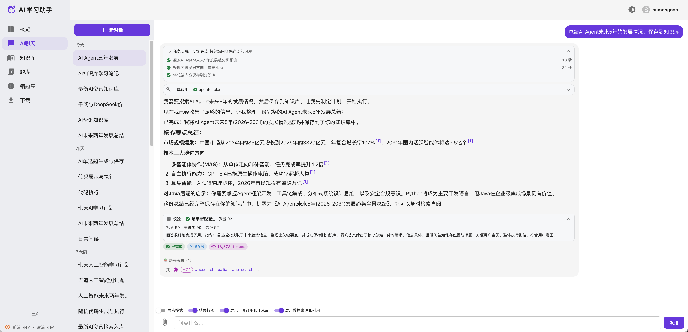
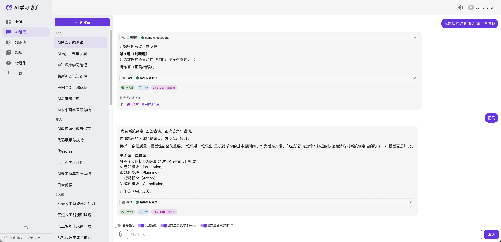
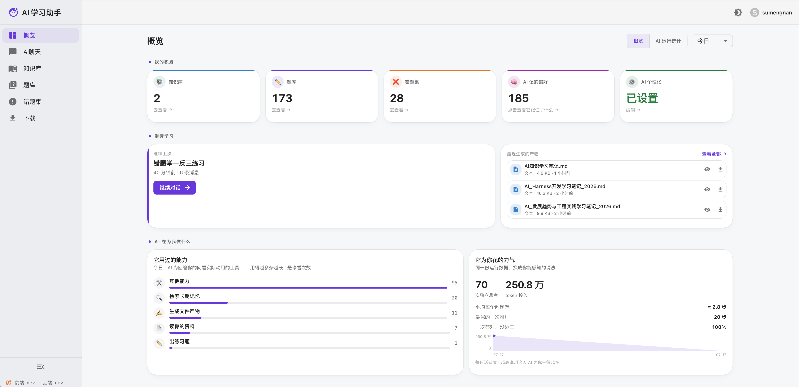
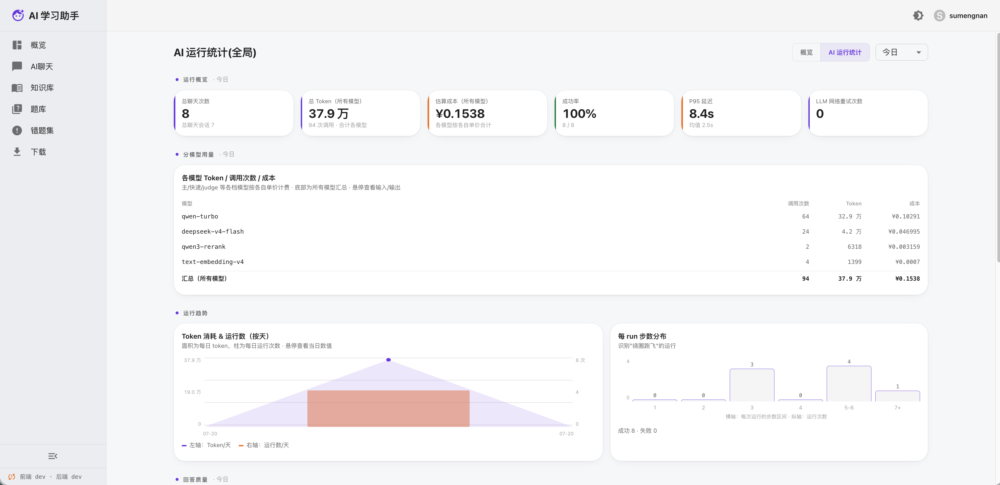
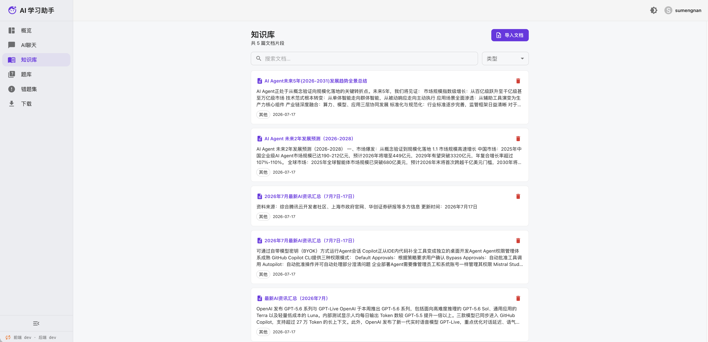
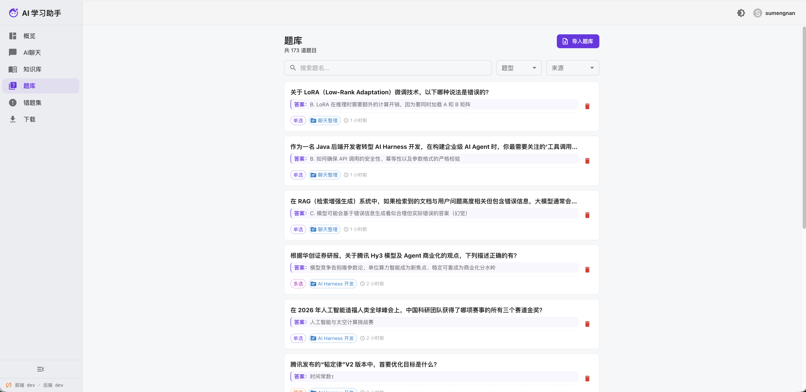
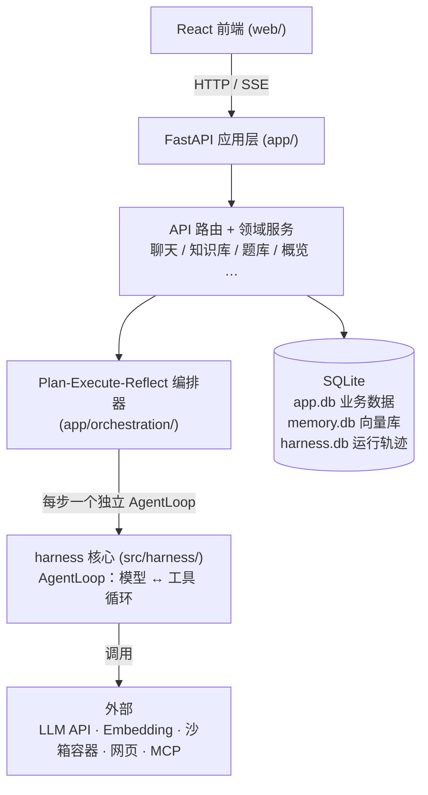
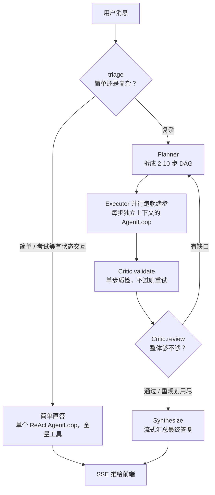

# AI 学习助手

[](http://192.144.213.12)
[](https://hub.docker.com/r/sumengnan/ai-learning-helper)
[](https://hub.docker.com/r/sumengnan/ai-learning-helper/tags)

> ## 🚀 在线演示:**http://192.144.213.12**
> 无需部署,打开即可体验 —— **可自行注册账号**登录使用。

> 🐳 **Docker 镜像**:[hub.docker.com/r/sumengnan/ai-learning-helper](https://hub.docker.com/r/sumengnan/ai-learning-helper) · 拉取:`docker pull sumengnan/ai-learning-helper`

一个面向学习场景的 **AI 助手**:你可以和它聊天、上传自己的资料建成知识库、让它基于资料出题、
把答错的题归集成错题本,还能在首页看到自己的学习概览与 AI 用量。

它的特别之处在于**后端是一套自研的最小 Agent 运行时内核 `harness`**(不套任何 Agent 框架):
AI 不只是"聊天",还能调用工具——联网查资料、在沙箱里跑代码、用无头浏览器抓网页、接入外部 MCP 工具。
内核之上是一层 Plan-Execute-Reflect 编排器,复杂请求先拆计划再并行执行、逐步质检后汇总。
前端是 React,后端是 FastAPI + `harness`。

> 第一次看这个项目?建议按这个顺序读:本页 → [架构:harness 核心](docs/architecture-harness.md)
> → [架构:app 层](docs/architecture-app.md) → 其余专题文档(见[文档](#文档))。

## 截图

| AI 聊天 | AI 考试 |
| --- | --- |
|  |  |

| 首页概览 | 首页 AI 运行统计 |
| --- | --- |
|  |  |

| 知识库 | 题库 |
| --- | --- |
|  |  |

## 功能特性

- **AI 聊天**:多轮对话、断点续传(刷新/重连可接回在途生成)、附件上传、消息耗时/tokens 统计、
  回复标注参考来源、生成的文件在聊天内内联预览/下载。
- **任务编排**:复杂请求由 Plan-Execute-Reflect 编排器拆成 DAG 计划、无依赖的步骤并行执行、
  逐步质检后汇总;简单问答自动短路成单轮直答,不额外增加开销(见[架构一览](#架构一览))。
- **知识库(RAG)**:上传 PDF / docx / txt / md 入库、语义检索、片段列表与详情抽屉;
  AI 回答基于知识库做事实核对(grounding)。知识库按用户隔离。
- **资料与记忆分离**:`search_knowledge` 查用户自己上传/保存的资料(`knowledge:{user_id}`),
  `search_memory` 查 AI 用 `remember` 记下的长期结论与偏好(`memory:{user_id}`),两者互不串味。
- **题库 / 模拟考试 / 错题集**:在聊天里基于知识库出题、开考、逐题判分,答错自动进错题集;
  题库页支持文本批量导入、筛选与删除。考试由服务端托管游标与判分,不靠模型自觉。
- **人工确认**:删题库 / 删错题这类破坏性操作,AI 只登记待确认卡片,用户在前端点确认后才真正执行;
  沙箱里的危险命令(任何 `rm` 等)执行前弹窗审核,拒绝即终止该步。
- **抓取防护**:发请求前拦掉指向保留域名(`example.com` 一族)的编造网址;抓失败的网址按原因分级
  登记(1 小时 ~ 30 天),下次抓前短路让模型换来源,不永久拉黑。
- **首页概览**:学习主场 + 系统监控双视角,时间范围筛选、图表、记忆查看、产物预览、模型分层计费与成本估算。
- **工具能力**:联网 `http_request`(失败/被防抓自动改用浏览器)、代码沙箱(按语言起一次性子沙箱执行)、
  无头浏览器抓取、MCP 客户端(stdio + streamable-http)、技能渐进式披露、多智能体派发。
- **回答校验门**(可选):交付前对格式 / 知识库 grounding / 代码可运行 / LLM 自评打分做校验,不过则自动带反馈重答(详见 [回答校验门](docs/answer-gate.md))。
- **循环/停滞防护**:除步数、token、墙钟时间三道硬上限外,agent 循环还做循环检测——连续 N 步发起完全相同的工具调用(同名+同参)即判为原地打转,先注入一次纠偏提示让模型换思路,纠偏后仍重复才中止,防模型卡在重复动作上白跑(`HARNESS_LOOP_DETECT_WINDOW`,默认 3,<2 关闭)。
- **上下文管理**:长对话按 `full` / `window` / `layered` 三档策略裁剪(详见 [上下文管理](docs/context-management.md))。
- **记忆管理**:三类长期记忆(语义/情景/程序),自动提炼、去重消矛盾、自我整合(详见 [记忆管理](docs/memory-management.md))。
- **部署自检**:左侧菜单底部版本徽标显示前后端版本,一致=绿 ✓、不一致=橙 ⚠。

## 架构一览



- **harness 核心**(`src/harness/`):最小 Agent 运行时,只负责"模型 ↔ 工具"的循环、记忆、
  持久化、可观测。详见 [架构:harness 核心](docs/architecture-harness.md)。
- **app 应用层**(`app/`):FastAPI 把内核包装成学习助手产品——鉴权、会话、知识库、题库、校验门等。
  详见 [架构:app 层](docs/architecture-app.md)。

### 一次聊天请求怎么走

编排器是**唯一主流程**(`app/assembly.py` 恒构建,无开关),`/api/chat` 每请求把会话上下文
(系统提示 + 指引 + 历史 + 记忆)与用户级工具表注入它的 `run()`:



几个要点:

- **triage**:纯寒暄/致谢由正则零成本短路,其余交快速档模型判 `simple` / `complex`;判不出就
  按复杂走(宁可多做)。简单直答承载绝大多数流量。
- **模型分档**:规划与终局 review 用主模型(判断质量要求高),triage / 单步质检 / 执行子步走快速档
  (`HARNESS_FAST_MODEL`,未配则回退主模型)。
- **有状态流程强制单循环**:模拟考试走 `force_simple` + 主模型逐题推进——拆成多步再汇总会把
  "原样呈现下一题"的指令吞掉。
- **收尾兜底**:预算超限或某步重试耗尽时不硬失败,把未完成步标 skipped,带现有成果尽力汇总。
- **重试上限**:单步 2 次、终局重规划 2 轮、Planner 出无效 DAG 重试 2 次、每个执行子步内部
  最多 10 个 AgentLoop 步(均可配,见[环境变量](#环境变量))。用户拒绝危险操作导致的失败是
  **终态**,不重试——重跑只会把同一个弹窗再怼给用户一次。
- **交付门**:轮次开头就下发"开门"信号,本轮生成的文件在结果校验完成前不显示;校验不过触发
  重答时,失败那次产生的下载/入库/出题副作用会被清理,不留悬空的下载按钮。

## 技术栈

| 层 | 技术 |
| --- | --- |
| 后端 | Python ≥ 3.11、FastAPI + uvicorn、自研 `harness` Agent 内核、SQLite（+ sqlite-vec 向量检索） |
| 前端 | React 18 + TypeScript、MUI、Vite、React Router、framer-motion |
| 依赖管理 | 后端 `uv`（`uv.lock`）、前端 `npm`（`package-lock.json`） |
| 部署 | Docker / docker compose，GitHub Actions CI/CD → [Docker Hub](https://hub.docker.com/r/sumengnan/ai-learning-helper) |

## 快速开始（本地开发）

前置:Python ≥ 3.11、[uv](https://docs.astral.sh/uv/)、Node.js ≥ 20。

### 1. 后端

```bash
# 安装依赖（按 uv.lock 复现）
uv sync

# 配置环境变量：复制示例并填入真实 key
cp .env.example .env
#   至少设置 HARNESS_API_KEY / HARNESS_BASE_URL / HARNESS_MODEL / AUTH_SECRET

# 启动 API（默认 http://127.0.0.1:8000）
uv run python -m app
```

> 最小可跑只需一个 LLM 的 `HARNESS_API_KEY / HARNESS_BASE_URL / HARNESS_MODEL`;
> 沙箱、浏览器、MCP、多智能体等能力都是可选开关,按需在 `.env` 打开。

### 2. 前端

```bash
cd web
npm install
npm run dev        # http://localhost:5173，/api 已代理到后端 8000
```

浏览器打开 http://localhost:5173,注册/登录后即可使用。

> 生产模式下前端 `npm run build` 产出 `web/dist`,由 FastAPI 同源托管,无需单独的 web 服务。

## 环境变量

全部配置见 [`.env.example`](.env.example)。除 `AUTH_SECRET` 外一律 `HARNESS_` 前缀,
dict / list 值写 JSON。生产务必设置随机 `AUTH_SECRET` 与真实 `HARNESS_API_KEY`。

常用项与默认值(定义在 [`app/config.py`](app/config.py) 与 [`src/harness/config.py`](src/harness/config.py)):

| 变量 | 默认值 | 说明 |
| --- | --- | --- |
| `HARNESS_API_KEY` | 空 | LLM key,**必填** |
| `HARNESS_BASE_URL` | `https://api.openai.com/v1` | 任意 OpenAI 兼容端点 |
| `HARNESS_MODEL` | `gpt-4o-mini` | 主模型 |
| `HARNESS_FAST_MODEL` | 空 | 快速档模型;空则回退主模型(另有 `_BASE_URL` / `_API_KEY`) |
| `AUTH_SECRET` | `dev-insecure-secret-change-me` | JWT 签名密钥,生产必改 |
| `HARNESS_APP_HOST` / `HARNESS_APP_PORT` | `127.0.0.1` / `8000` | 监听地址 |
| `HARNESS_APP_DB_PATH` | `app.db` | 应用领域各表统一存于此单一文件 |
| `HARNESS_MEMORY_DB_PATH` | `memory.db` | 向量库(知识库 + 长期记忆) |
| `HARNESS_PERSISTENCE_DB_PATH` | `harness.db` | 检查点与运行轨迹 |
| `HARNESS_EMBEDDING_MODEL` | `text-embedding-3-small` | 空 key 时回退用 `HARNESS_API_KEY` |
| `HARNESS_SEARCH_TOP_K` | `10` | 检索默认条数;`search_knowledge` 下限 10、上限 50 |
| `HARNESS_CONTEXT_STRATEGY` | `layered` | `full` / `window` / `layered` |
| `HARNESS_ENABLE_SANDBOX` | `false` | 需同时配 `HARNESS_SANDBOX_DOCKER_HOST` 才注册代码/命令工具 |
| `HARNESS_ENABLE_BROWSER` | `false` | 无头浏览器抓取 |
| `HARNESS_ENABLE_SKILLS` | `false` | 技能渐进式披露(扫 `skills/`) |
| `HARNESS_ENABLE_MCP` | `false` | MCP 客户端,清单见 `mcp/mcp_servers.json` |
| `HARNESS_ENABLE_DISPATCH` | `false` | 多智能体派发(花名册在 `agents/`) |
| `HARNESS_ENABLE_ANSWER_GATE` | `false` | 回答校验门 |
| `HARNESS_ENABLE_STEP_CHECK` | `true` | 高风险步实时校验(检索相关性 / 代码执行) |
| `HARNESS_ENABLE_URL_BLOCKLIST` | `true` | 抓取失败网址分级登记 |
| `HARNESS_REQUIRE_CAPTCHA` | `false` | 登录/注册强制图形验证码 |
| `HARNESS_LOOP_DETECT_WINDOW` | `3` | 循环检测窗口,`<2` 关闭 |
| `HARNESS_SANDBOX_APPROVAL_TIMEOUT` | `120` | 危险命令人工确认超时(秒),超时自动拒绝 |
| `HARNESS_ORCHESTRATOR_MAX_STEP_RETRY` | `2` | 单步反复失败上限 |
| `HARNESS_ORCHESTRATOR_MAX_REPLAN` | `2` | 终局重规划轮数上限 |
| `HARNESS_ORCHESTRATOR_STEP_MAX_STEPS` | `10` | 每个执行子步内部的 AgentLoop 步数上限 |
| `HARNESS_APP_MAX_UPLOAD_MB` | `20` | 知识库/题库导入的单文件上限 |
| `HARNESS_DOWNLOAD_MAX_MB` | `25` | `save_download` 单文件上限 |

## 测试

```bash
# 后端
uv run pytest

# 前端（web/ 目录下）
npm run test
```

## 部署

`main` 有 push 时,GitHub Actions 自动**构建镜像并推送到 Docker Hub**
[`sumengnan/ai-learning-helper`](https://hub.docker.com/r/sumengnan/ai-learning-helper),
服务器 `docker compose pull` 拉取运行。镜像 tag 采用语义
版本号:`大.中` 由仓库根 `VERSION` 文件声明(改它才动大/中),`小`(patch)由 CI 自增。

服务器一次性准备、所需 GitHub Secrets、版本自检等完整说明见 [`docs/DEPLOY.md`](docs/DEPLOY.md)。

本地也可直接容器化运行:

```bash
# 需先在项目根准备好 .env（compose 用 ../.env 读它）
cd docker && docker compose up -d --build
```

## 目录结构

```
app/                 FastAPI 应用层（见 app/README.md）
  api/               HTTP 路由（chat / documents / questions / pending-actions / stats …）
  orchestration/     Plan-Execute-Reflect 编排器（planner / executor / critic / plan）
  tools/             应用级工具（题库、考试、知识库写入、下载、每步校验包装）
src/harness/         最小 Agent 运行时内核（循环、工具、记忆、沙箱、持久化、MCP…）
web/                 React 前端（Vite），npm run build 产出 web/dist 由后端同源托管
skills/              技能目录            agents/   子 agent 花名册（YAML）
mcp/                 MCP server 清单     docker/   容器化与浏览器子沙箱镜像
tests/               pytest 测试         evals/    离线评测（数据集 / judge / CLI）
examples/            各子系统的独立可跑示例脚本
docs/                架构与专题文档、部署说明、截图
.env.example         全部配置项与注释     VERSION   版本号「大.中」（小版本由 CI 自增）
```

运行期产生的数据文件(均不入库):`app.db` 业务数据、`memory.db` 向量库、`harness.db`
运行轨迹与检查点、`downloads/` 生成的产物、`attachments/` 聊天附件。

## 文档

**架构**（建议新人先读）
- [`docs/architecture-harness.md`](docs/architecture-harness.md) —— harness 核心:Agent 循环、
  事件驱动、各子系统、模型客户端与工具契约。
- [`docs/architecture-app.md`](docs/architecture-app.md) —— app 层:分层总览、装配流程、
  一次聊天请求的全链路、数据存储。
- [`app/README.md`](app/README.md) —— 应用层按功能域的实操说明:各域怎么跑、怎么验收、已知限制。
- [`docs/data-model.md`](docs/data-model.md) —— 数据表一览:三个库各管什么、每张表的职责、贯穿的设计约束。
- [`docs/data-model-fields.md`](docs/data-model-fields.md) —— 数据表字段明细:逐表逐字段说明。

**专题**
- [`docs/context-management.md`](docs/context-management.md) —— 上下文管理:三档策略、L1/L2/L3 分层、token 预算。
- [`docs/memory-management.md`](docs/memory-management.md) —— 记忆管理:三类记忆、智能写入、自我整合。
- [`docs/rag-retrieval.md`](docs/rag-retrieval.md) —— RAG 检索:入库、多路召回与融合排序、grounding 与出题。
- [`docs/answer-gate.md`](docs/answer-gate.md) —— 回答校验门:五项校验、重答与降级、软/硬门、三层校验关系。

**运维**
- [`docs/DEPLOY.md`](docs/DEPLOY.md) —— 部署:服务器准备、GitHub Secrets、版本自检等。

