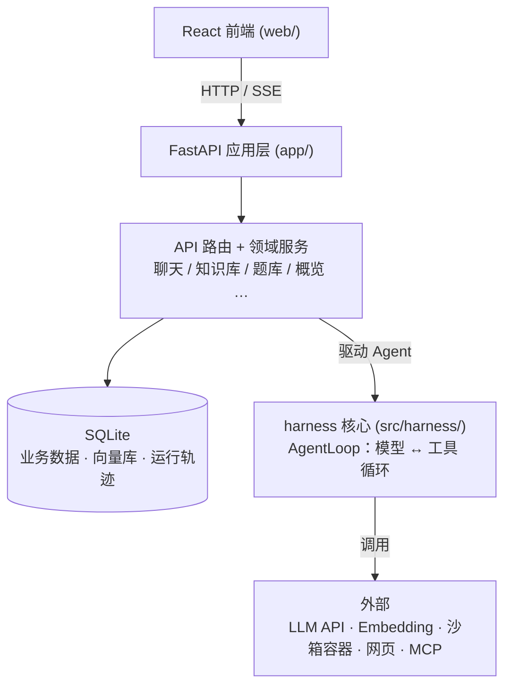

# AI 学习助手

[](https://hub.docker.com/r/sumengnan/ai-learning-helper)
[](https://hub.docker.com/r/sumengnan/ai-learning-helper/tags)

> 🐳 **Docker 镜像**:[hub.docker.com/r/sumengnan/ai-learning-helper](https://hub.docker.com/r/sumengnan/ai-learning-helper) · 拉取:`docker pull sumengnan/ai-learning-helper`

一个面向学习场景的 **AI 助手**:你可以和它聊天、上传自己的资料建成知识库、让它基于资料出题、
把答错的题归集成错题本,还能在首页看到自己的学习概览与 AI 用量。

它的特别之处在于**后端是一套自研的最小 Agent 运行时内核 `harness`**(不套任何 Agent 框架):
AI 不只是"聊天",还能调用工具——联网查资料、在沙箱里跑代码、用无头浏览器抓网页、接入外部 MCP 工具。
前端是 React,后端是 FastAPI + `harness`。

> 第一次看这个项目?建议按这个顺序读:本页 → [架构:harness 核心](docs/architecture-harness.md)
> → [架构:app 层](docs/architecture-app.md) → 其余专题文档(见[文档](#文档))。

## 截图

| AI 聊天 | AI 考试 |
| --- | --- |
|  |  |

| 首页概览 | 首页 AI 运行统计 |
| --- | --- |
|  |  |

| 知识库 | 题库 |
| --- | --- |
|  |  |

## 功能特性

- **AI 聊天**:多轮对话、断点续传(刷新/重连可接回在途生成)、附件上传、消息耗时/tokens 统计、
  回复标注参考来源、生成的文件在聊天内内联预览/下载。
- **知识库(RAG)**:上传文档入库、语义检索、片段抽屉预览;AI 回答基于知识库做事实核对(grounding)。
- **题库 / 错题集**:基于知识库出题、作答判分,答错的题自动归集回顾;支持题库文本批量导入。
- **首页概览**:学习主场 + 系统监控双视角,时间范围筛选、图表、记忆查看、产物预览、模型分层计费与成本估算。
- **工具能力**:联网 `http_request`(失败/被防抓自动改用浏览器)、代码沙箱(按语言起一次性子沙箱执行)、
  无头浏览器抓取、MCP 客户端(stdio + streamable-http)、多智能体派发。
- **回答校验门**(可选):交付前对格式 / 知识库 grounding / 代码可运行 / LLM 自评打分做校验,不过则自动带反馈重答(详见 [回答校验门](docs/answer-gate.md))。
- **循环/停滞防护**:除步数、token、墙钟时间三道硬上限外,agent 循环还做循环检测——连续 N 步发起完全相同的工具调用(同名+同参)即判为原地打转、提前中止,防模型卡在重复动作上白跑(`HARNESS_LOOP_DETECT_WINDOW`,默认 3,<2 关闭)。
- **上下文管理**:长对话按 `full` / `window` / `layered` 三档策略裁剪(详见 [上下文管理](docs/context-management.md))。
- **记忆管理**:三类长期记忆(语义/情景/程序),自动提炼、去重消矛盾、自我整合(详见 [记忆管理](docs/memory-management.md))。
- **部署自检**:左侧菜单底部版本徽标显示前后端版本,一致=绿 ✓、不一致=橙 ⚠。

## 架构一览



- **harness 核心**(`src/harness/`):最小 Agent 运行时,只负责"模型 ↔ 工具"的循环、记忆、
  持久化、可观测。详见 [架构:harness 核心](docs/architecture-harness.md)。
- **app 应用层**(`app/`):FastAPI 把内核包装成学习助手产品——鉴权、会话、知识库、题库、校验门等。
  详见 [架构:app 层](docs/architecture-app.md)。
## 技术栈

| 层 | 技术 |
| --- | --- |
| 后端 | Python ≥ 3.11、FastAPI + uvicorn、自研 `harness` Agent 内核、SQLite（+ sqlite-vec 向量检索） |
| 前端 | React 18 + TypeScript、MUI、Vite、React Router、framer-motion |
| 依赖管理 | 后端 `uv`（`uv.lock`）、前端 `npm`（`package-lock.json`） |
| 部署 | Docker / docker compose，GitHub Actions CI/CD → [Docker Hub](https://hub.docker.com/r/sumengnan/ai-learning-helper) |

## 快速开始（本地开发）

前置:Python ≥ 3.11、[uv](https://docs.astral.sh/uv/)、Node.js ≥ 20。

### 1. 后端

```bash
# 安装依赖（按 uv.lock 复现）
uv sync

# 配置环境变量：复制示例并填入真实 key
cp .env.example .env
#   至少设置 HARNESS_API_KEY / HARNESS_BASE_URL / HARNESS_MODEL / AUTH_SECRET

# 启动 API（默认 http://127.0.0.1:8000）
uv run python -m app
```

> 最小可跑只需一个 LLM 的 `HARNESS_API_KEY / HARNESS_BASE_URL / HARNESS_MODEL`;
> 沙箱、浏览器、MCP、多智能体等能力都是可选开关,按需在 `.env` 打开。

### 2. 前端

```bash
cd web
npm install
npm run dev        # http://localhost:5173，/api 已代理到后端 8000
```

浏览器打开 http://localhost:5173,注册/登录后即可使用。

> 生产模式下前端 `npm run build` 产出 `web/dist`,由 FastAPI 同源托管,无需单独的 web 服务。

## 环境变量

全部配置见 [`.env.example`](.env.example)（`HARNESS_` 前缀,另有 `AUTH_SECRET`),涵盖模型、
沙箱、无头浏览器、MCP、回答校验门、上下文管理策略等。生产务必设置随机 `AUTH_SECRET` 与真实
`HARNESS_API_KEY`。

## 测试

```bash
# 后端
uv run pytest

# 前端（web/ 目录下）
npm run test
```

## 部署

`main` 有 push 时,GitHub Actions 自动**构建镜像并推送到 Docker Hub**
[`sumengnan/ai-learning-helper`](https://hub.docker.com/r/sumengnan/ai-learning-helper),
服务器 `docker compose pull` 拉取运行。镜像 tag 采用语义
版本号:`大.中` 由仓库根 `VERSION` 文件声明(改它才动大/中),`小`(patch)由 CI 自增。

服务器一次性准备、所需 GitHub Secrets、版本自检等完整说明见 [`docs/DEPLOY.md`](docs/DEPLOY.md)。

本地也可直接容器化运行:

```bash
# 需先在项目根准备好 .env（compose 用 ../.env 读它）
cd docker && docker compose up -d --build
```

## 目录结构

```
app/          FastAPI 应用层（api 路由、会话/知识/题库/下载等领域服务）
src/harness/  最小 Agent 运行时内核（循环、工具、记忆、沙箱、持久化、MCP…）
web/          React 前端（Vite）
skills/       技能目录          agents/  子 agent 花名册
tests/        pytest 测试        docker/  容器化与浏览器子沙箱镜像
docs/         架构与专题文档、部署说明、截图
VERSION       部署版本号的「大.中」声明（小版本由 CI 自增）
```

## 文档

**架构**（建议新人先读）
- [`docs/architecture-harness.md`](docs/architecture-harness.md) —— harness 核心:Agent 循环、
  事件驱动、各子系统、模型客户端与工具契约。
- [`docs/architecture-app.md`](docs/architecture-app.md) —— app 层:分层总览、装配流程、
  一次聊天请求的全链路、数据存储。

**专题**
- [`docs/context-management.md`](docs/context-management.md) —— 上下文管理:三档策略、L1/L2/L3 分层、token 预算。
- [`docs/memory-management.md`](docs/memory-management.md) —— 记忆管理:三类记忆、智能写入、自我整合。
- [`docs/rag-retrieval.md`](docs/rag-retrieval.md) —— RAG 检索:入库、多路召回与融合排序、grounding 与出题。
- [`docs/answer-gate.md`](docs/answer-gate.md) —— 回答校验门:五项校验、重答与降级、软/硬门、三层校验关系。

**运维**
- [`docs/DEPLOY.md`](docs/DEPLOY.md) —— 部署:服务器准备、GitHub Secrets、版本自检等。

