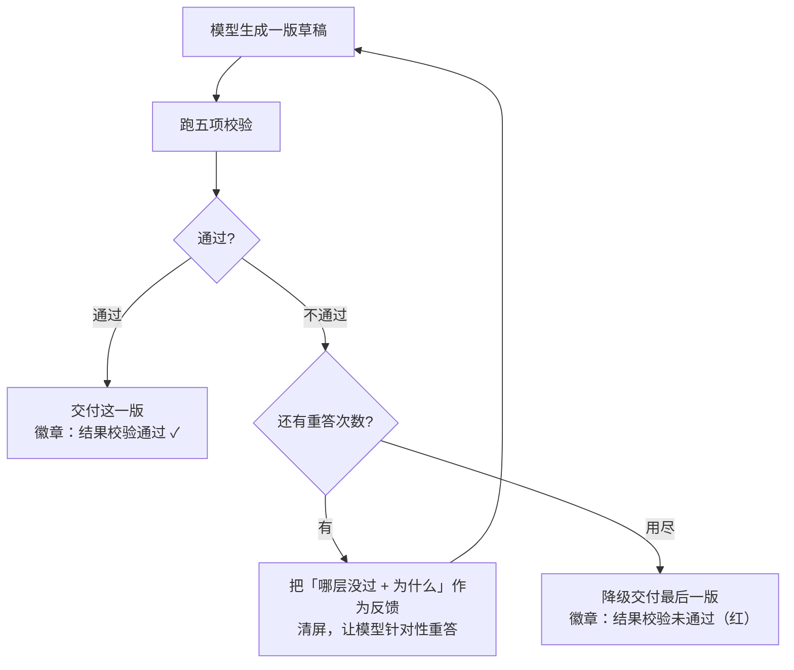

# 回答校验门

> 面向第一次接触本项目的人。读完你会明白:AI 在把答案交给你之前,是怎么"自己先检查一遍、
> 不合格就重答"的。

## 一句话理解

普通 AI 是"想到什么说什么",说完就完。**回答校验门**(Answer Delivery Gate)给它加了一道
**交付前质检**:AI 先把答案憋在手里,对它做几项检查——有没有编造、代码跑不跑得通、有没有
答到点上——**通过了才交付给你;不通过就带着"哪里不对"重答一遍**,最多重答 N 次。

好比一篇稿子写完先过一遍校对,而不是直接见报。

## 为什么需要它

大模型有几个常见毛病:一本正经地编事实、给出的代码其实跑不通、答非所问或漏答。校验门就是
针对这些,在交付前用规则和"挑错视角"的模型自查一遍,把明显不合格的挡下来重做。

> 它默认**关闭**(保持直通流式的现状),按需在配置里打开:`HARNESS_ENABLE_ANSWER_GATE=true`。

## 五项校验

开启后,一版草稿会**按从便宜到贵的顺序**依次检查,任一项不过就算这版不合格:

| # | 检查项 | 查什么 | 软/硬 | 何时触发 | 用 LLM? |
| --- | --- | --- | --- | --- | --- |
| 1 | **格式** | 非空、代码围栏是否闭合(防被截断) | 硬 | 总是 | 否(最快,先短路) |
| 2 | **grounding(依据)** | 回答里的**事实性陈述**能否被本轮检索到的资料(知识库/联网/读入的文档)支撑 | 软 | 仅当本轮命中了知识库 | 是 |
| 3 | **代码可运行** | 把答案里的代码块(python/node/java)在**会话沙箱里真跑一遍**,报错即不过 | 硬 | 仅当答案含代码块、且有沙箱 | 否(实跑) |
| 4 | **引用链接** | 答案里的 http(s) 链接是否可达(2xx/3xx) | 软 | 仅当答案含链接 | 否 |
| 5 | **质量评分** | 独立 judge 模型用"挑错视角"给答案打分,低于阈值不过 | 软 | 总是 | 是 |

每项都可单独开关(见[配置](#配置)),用不到的场景不会白花成本(比如没代码就不跑代码检查)。

关于 grounding 的一个细节:它只核查**关于主题的客观事实**是否有依据;问候语、建议、对资料的
忠实改写/归纳/总结、常识与合理推理**都不算"缺依据"**——所以"把知识库整理成笔记"不会被误判。

## 通过 or 不通过,分别怎么办

- **通过**:直接交付,前端显示绿色"结果校验通过"。
- **不通过且还能重答**:把不合格的原因(哪一层、为什么)作为反馈回喂给模型,清屏后重答一版。
  默认最多重答 1 次(`answer_gate_max_retries`,总尝试 = N+1)。
- **用尽次数仍不过**:**降级交付**——把最后一版给你(不假装通过),前端用**红色"未通过"徽章**
  如实标出。若连一个字都没产出(硬性的空/截断),本轮直接记为出错而非完成。

## 软门 vs 硬门

- **硬门**(格式 / 代码可运行 / 未产出答案):属于"必须修好"的硬伤。理想是靠重答修复;若压根
  没产出答案,本轮判为出错。
- **软门**(grounding / 引用链接 / 质量评分):是质量增强项。重答用尽仍不过时,允许"降级交付"
  并标红——一份有小瑕疵的答案,通常仍比什么都不给强。

这个软/硬分类会记进结构化轨迹,供后台统计"哪层最容易失败、平均重答几次"。

## 一个贴心细节:清理未通过版的副作用

如果某版草稿**已经产生了副作用**(生成了下载文件、写了知识库、入库了题目),但这版没通过要重答,
校验门会在交付时**清理掉被取代的旧产物**——避免给你留下一个点开就失效的下载按钮。本版重新做了的
就保留、被丢弃的就删掉。

## 它和另外两层校验的关系

本项目的"校验"其实有**三层**,校验门是其中最主要的一层:

| 层 | 时机 | 做什么 | 开关 |
| --- | --- | --- | --- |
| **每步校验** | 执行中(实时) | 高风险步的规则校验:检索结果相关性、代码执行是否报错 | `enable_step_check`(默认开) |
| **回答校验门** | 交付前 | 本文讲的五项校验 + 重答 | `enable_answer_gate`(默认关) |
| **轨迹 judge** | 交付前(一次) | 回看整条轨迹(任务拆分/关键步/最终答案)分层打分,并可并入软门 | `enable_trajectory_judge`(默认关) |

## 配置

均为 `HARNESS_` 前缀环境变量(定义见 `app/config.py`):

| 环境变量 | 默认 | 说明 |
| --- | --- | --- |
| `HARNESS_ENABLE_ANSWER_GATE` | `false` | 校验门总开关 |
| `HARNESS_ANSWER_GATE_MAX_RETRIES` | `1` | 不过时的自动重答次数 N(总尝试 N+1) |
| `HARNESS_ANSWER_PASS_SCORE` | `60` | 质量评分阈值(低于则不过) |
| `HARNESS_GATE_CHECK_FORMAT` | `true` | 分项开关:格式/完整性 |
| `HARNESS_GATE_CHECK_GROUNDING` | `true` | 分项开关:知识库依据 |
| `HARNESS_GATE_CHECK_CODE` | `true` | 分项开关:代码可运行 |
| `HARNESS_GATE_CHECK_JUDGE` | `true` | 分项开关:LLM 自评打分 |
| `HARNESS_GATE_CHECK_FACTS` | `false` | 分项开关:引用链接可达性 |
| `HARNESS_JUDGE_MODEL` 等 | 空 | 独立 judge 模型/端点/key(降低"自评打高分"偏差);空则回退主模型 |
| `HARNESS_ENABLE_TRAJECTORY_JUDGE` | `false` | 轨迹 judge(可单独开) |
| `HARNESS_TRAJECTORY_PASS_SCORE` | `60` | 轨迹最终层分数阈值 |
| `HARNESS_ENABLE_STEP_CHECK` | `true` | 每步实时校验 |

## 代码位置

| 文件 | 职责 |
| --- | --- |
| `app/verify.py` | `AnswerVerifier`(五项校验)+ `TrajectoryJudge`(轨迹打分) |
| `app/api/chat.py` | 交付门循环:缓冲草稿 → 校验 → 重答/降级、副作用清理、徽章事件 |
| `app/tools/validating.py` | 每步校验的工具包装(检索相关性 / 代码执行) |
| `app/config.py` | 上表所有开关与阈值 |
