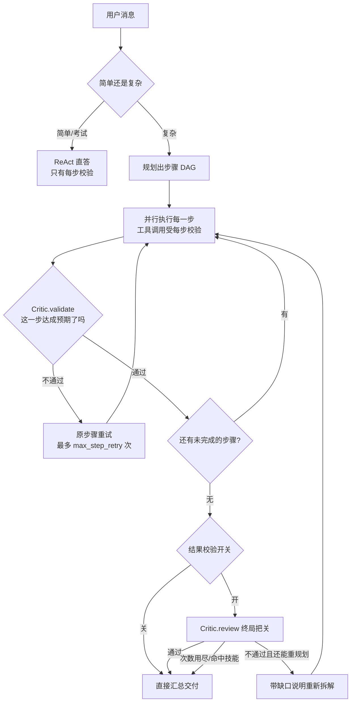

# 回答把关

> 面向想知道「AI 给我的这个答案，交出来之前经过了哪些检查」的人。

## 一句话理解

普通 AI 是想到什么说什么，说完就完。本项目在答案交给你之前有**两道实际生效的把关**：
干活途中每调一次高风险工具就查一次（**每步校验**），所有步骤跑完再整体审一遍
（**编排器的分层反思**）。不合格的会带着「哪里不对」重做，而不是直接端给你。

## 主流程长什么样

聊天请求恒走 **Plan-Execute-Reflect 编排器**（`app/orchestration/orchestrator.py`，无开关，
装配层恒构建）。它先判简单/复杂：

- **简单**（纯寒暄、单句问答，或考试这类有状态流程）→ 单个 ReAct 循环直答，**不经 Critic**。
  这条路上只有每步校验在起作用。
- **复杂** → 规划出步骤 DAG，并行执行，每步产出交 `Critic.validate` 单步校验，全部跑完交
  `Critic.review` 终局把关。

## 一、编排器的分层反思（主把关）

代码在 `app/orchestration/critic.py`。两个判官，都用 LLM 出严格 JSON。

### `Critic.validate` —— 单步校验

每个步骤跑完，把「子任务描述 + 预期产出 + 实际产出」交给它判「达成了吗」。
判据刻意**宽松务实**：方向对、内容基本可用就算通过，只有明显答非所问、空洞、南辕北辙才判不通过。
走快速档模型（调用频繁，用 `HARNESS_FAST_MODEL`，未配则回退主模型）。

不通过 → 该步回到就绪集重试，把不通过的理由作为提示带给下一次尝试（`retry_hints`）；
重试到 `orchestrator_max_step_retry`（默认 2，含首次）仍不行就判 `failed`，依赖它的后续步骤
自然断掉，交终局判。

### `Critic.review` —— 终局把关

所有步骤跑完，把「用户目标 + 各步产出」整体过一遍：够不够格作为对用户的答复。
走主模型（判断质量要求高）。不通过时会带 `feedback` 说明缺口，编排器据此**重新规划**，
最多 `orchestrator_max_replan` 轮（默认 2）。已完成步骤的产物跨轮累积保留，不会因重规划丢掉。

对应前端聊天页的**「结果校验」开关**（默认开）：关掉则跑完一轮直接汇总交付，不做终局 review、
不重规划——更快，但不把关。

### 三条重要的例外规则

| 规则 | 行为 | 为什么 |
| --- | --- | --- |
| **澄清豁免** | 子步因确实缺少无法自行推断的关键信息（目标、范围、格式、版本、时间、约束等）而向用户提问、或明确标出「缺什么、需要用户确认什么」→ 判**通过** | 执行子步本就被要求「信息不足先问、不要猜」（`CLARIFY_GUIDE`）。若这里再把提问判成未达成，就是一边让它问、一边因为它问而罚它——重试压力下模型只会改去瞎猜。 但要区分敷衍：泛泛说「信息不足」却说不出缺哪一项，或缺的只是可按默认推进的小事，仍判不通过 |
| **命中技能不重规划** | 本轮被技能路由匹配到技能剧本时，即使 review 不通过也不重新拆解，带现有产物直接定稿 | 剧本就是这类任务的既定流程，重新拆解等于把它推翻，用户会看到步骤中途凭空变样。单步做砸由 `max_step_retry` 在原步骤内兜住 |
| **用户拒绝危险操作 → 终态失败** | 步骤里含被用户拒绝的操作（工具返回「命令未执行：用户拒绝了该操作」）时，该步直接判 `failed`，**不重试** | 拒绝是人做出的决定，再跑一遍不会有不同结果，只会把同一个确认弹窗怼到用户脸上第二次 |

澄清豁免同时写在 `VALIDATE_SYSTEM` 和 `REVIEW_SYSTEM` 里。终局 review 另有一条更强的：
当缺口只能由用户回答时，一律 `accept=true`——重规划拿不到用户没给过的信息，只会空转几轮后
被迫瞎猜，正确做法是把问题交付给用户。汇总阶段（`SYNTH_SYSTEM`）也被要求把该问题明确提给用户，
不许自行假设填补。

> **判官抖动一律放行（fail-open）**：validate/review 的 LLM 调用失败或 JSON 解析失败时，
> 一律当通过处理并记日志。绝不因基建抖动拦住一份可能是好的答案。
> 模型返回字符串 `"false"` 这类脏数据会被 `_coerce_bool` 显式识别，不会被裸 `bool()` 误判成通过。

## 二、每步校验（`ValidatingTool`）

代码在 `app/tools/validating.py`，由 `HARNESS_ENABLE_STEP_CHECK` 控制（**默认开**）。
它用装饰器包住高风险工具，规则判定，不用 LLM，内核零改动。两种策略：

| 包住谁 | 校验器 | 查什么 | 不过怎么办 |
| --- | --- | --- | --- |
| 知识库检索 `search_knowledge` | `relevance_check` | 是否空命中 | 把「本次未检索到依据，请勿臆造事实」追加到结果尾部，**驱动模型下一步自纠正**（不硬阻断） |
| 联网抓取 `http_request` / `browse` | `web_content_check` | 抓到的是不是**占位域名**（example.com 等）或**空壳页**（正文 < 80 字符） | 同上，提示「多半是凭印象编造的网址，请改用搜索工具查真实网址，不要引用本次内容」 |
| 代码/命令类 `run_shell` / `run_python` / `run_node` / `run_java` | `exec_mode=True` | inner 是否抛 `ToolError`（非零退出/超时） | 发一条「执行未通过」标记后**原样重抛**，语义不变，仍走内核的 `is_error` 自纠正 |

`web_content_check` 补的是既有来源过滤盖不到的一层：模型凭印象编一个 `example.com/xxx`，抓取会
**成功**——真实域名、HTTP 200、有标题有正文——靠状态码根本拦不住。只对渲染成「标题+正文」的网页
结果生效（认 `最终URL：` 标记），JSON/API 原样透传的结果一律放行，避免误伤接口调用。

校验结果经 `Progress(scope="check", key="check:<工具名>")` 推到 SSE，前端在校验徽章的「步骤校验」
分组里逐条展示。校验器自身出异常绝不吞掉工具原结果，只跳过该步校验。

## 三、交付门 `AnswerVerifier`（当前是兜底路径）

`app/verify.py` 里的 `AnswerVerifier`，即老的「回答校验门」：缓冲草稿 → 逐项校验 → 不过带反馈
重答。**它现在不在主流程上**——`app/api/chat.py` 里那条 `elif not gate_on` 的 ReAct + 交付门分支，
只在 `harness.orchestrator` 缺失时（如精简测试注入 `None`）才惰性兜底。真实请求恒走编排器分支。
且它需要三者皆备才开：装配了 verifier + `HARNESS_ENABLE_ANSWER_GATE`（**默认 false**）+ 本轮
用户开关。

跑到时，按从便宜到贵的顺序短路检查：

| # | 检查项 | 查什么 | 软/硬 | 何时触发 |
| --- | --- | --- | --- | --- |
| 1 | **format** | 非空、代码围栏是否闭合（防被截断） | 硬 | 总是（不用 LLM，最先短路） |
| 2 | **grounding** | 回答里的事实性陈述能否被本轮检索到的资料支撑 | 软 | **仅当本轮 `search_knowledge` 有命中** |
| 3 | **code** | 把答案里的 python/node/java 代码块在会话沙箱里**真跑一遍** | 硬 | 答案含代码块且对应工具已注册 |
| 4 | **facts** | 答案里的 http(s) 链接是否可达（非 4xx/5xx） | 软 | 答案含链接（默认关，至多查前 5 个） |
| 5 | **judge** | 独立 judge 模型用挑错视角打分，低于 `answer_pass_score` 不过 | 软 | 总是 |

关于 grounding 的两个细节，容易记错：

- **触发条件是「本轮 `search_knowledge` 有命中」**（`if kb:`）。纯联网轮**不触发**——刻意不扩大，
  避免给大量联网问答新增 grounding 噪音。判据的工具名是 `search_knowledge`（不是 `search_memory`）。
- **核查上下文比触发条件宽**：一旦触发，知识库命中 + 本轮 `read_attachment`/`read_file` 读入的
  文档正文 + 联网检索结果会一并作为核查资料（去重后截断到 12000 字符）。否则「知识库+联网」混用时，
  联网来的事实会因不在知识库而被误判缺依据。

grounding 只核查**关于主题的客观事实**：问候语、建议、对资料的忠实改写/归纳/总结、常识与合理推理
都不算缺依据——所以「把知识库整理成笔记」不会被误判。

**软 vs 硬**：硬门（format / code / 未产出答案 `empty`）是必须修好的硬伤；软门
（grounding / facts / judge）是质量增强项，重答次数用尽仍不过时允许**降级交付**并标红——
一份有小瑕疵的答案通常仍比什么都不给强。未通过轮已产生的副作用（下载文件、知识库写入、入库题目）
会在交付时结算：被新版取代的删掉，新版没重做的保留，免得留下点开就失效的下载按钮。

> 校验器自身故障（非回答质量问题）同样 fail-open：跳过校验照常交付，但记进 `verify` 列的
> `gate_error`，后台能统计「多少轮没真校验过」。

### verify.py 里主流程仍在用的部分

- `TrajectoryJudge`：编排器路径上交付后额外打一次分层质量分（拆分/关键步/最终），落 progress 列
  供「AI 运行统计 · 回答质量」展示，**不驱动重答**。需 `HARNESS_ENABLE_TRAJECTORY_JUDGE`
  （默认关），且本轮工具步 > 1 才评。
- `call_json`：`Critic` 复用它做强制 JSON 输出与解析，两边判分口径一致。

## 四、开门信号与前端表现

轮次一开头，服务端就下发一条 `Progress(scope="verify", key="verify:gate-open")`
（`GATE_OPEN_KEY`，`app/api/chat.py` 与 `web/src/components/VerifyBadge.tsx` 同名常量）。

- **用途**：让前端在交付前**盖住本轮生成的文件**。必须赶在编排器跑之前发——执行子步的
  `save_download` 远早于那条「结果校验中…」，不先发这条，文件会在校验还没开始时就冒出来，
  而未通过重答时这些产物会被清掉，等于给用户一个马上失效的下载按钮。
- **负向门控**：仅当 `req.verify` 为真才发。关掉「结果校验」开关的轮次一条 verify 事件都不发，
  前端见不到信号即照常显示文件，不会出现「永远不显示」。
- **不落库**：刷新后由已存的终态记录决定展示即可；落库反而会在用户中途停止时留下一条永远转圈的
  「生成中…」。
- **不算校验进展**：徽章渲染时用 `isGateOpen` 把它排除在外——此刻模型连初稿都没生成，没有任何
  东西可校验，算进去会让回答刚起头就转圈谎称「正在校验」。

徽章（`VerifyBadge`）的主行文案自报层级：本轮有结果层信号（verify 事件或质量分）时说
「结果校验通过/未通过」，只有每步校验信号时降级说「步骤校验通过/未通过」——否则用户关掉
「结果校验」开关后，仅由每步校验触发的徽章仍写「校验通过」，等于谎称结果被校验过。
展开后按来源分组：步骤校验 / 结果校验 / 三层质量分。

## 配置

除 `AUTH_SECRET` 外全部是 `HARNESS_` 前缀环境变量（定义见 `app/config.py`）。

**编排器（无总开关，恒生效）**

| 环境变量 | 默认 | 说明 |
| --- | --- | --- |
| `HARNESS_ORCHESTRATOR_MAX_STEP_RETRY` | `2` | 单步反复失败上限（含首次） |
| `HARNESS_ORCHESTRATOR_MAX_REPLAN` | `2` | 终局 review 不通过时的重规划轮数上限 |
| `HARNESS_ORCHESTRATOR_PLANNER_MAX_RETRIES` | `2` | Planner 出无效 DAG 的重试上限 |
| `HARNESS_ORCHESTRATOR_STEP_MAX_STEPS` | `10` | 每个执行子步内部 AgentLoop 的步数上限 |
| `HARNESS_ORCHESTRATOR_STEP_DISABLE_THINKING` | `true` | 执行子步强制关思考链（机械执行提速） |
| `HARNESS_FAST_MODEL` / `_BASE_URL` / `_API_KEY` | 空 | 快速档模型（triage、单步 validate、执行子步、简单直答）；空则回退主模型 |

**每步校验**

| 环境变量 | 默认 | 说明 |
| --- | --- | --- |
| `HARNESS_ENABLE_STEP_CHECK` | `true` | 每步实时校验总开关 |
| `HARNESS_STEP_RELEVANCE_MIN` | `0.0` | 检索低分阈值。**目前是预留项**：`relevance_check` 只判空命中，代码里没有任何地方读它（检索工具未暴露相似度分数） |

**交付门 / 轨迹 judge**

| 环境变量 | 默认 | 说明 |
| --- | --- | --- |
| `HARNESS_ENABLE_ANSWER_GATE` | `false` | 交付门总开关（当前仅在 orchestrator 缺失的兜底路径生效） |
| `HARNESS_ANSWER_GATE_MAX_RETRIES` | `1` | 不过时的自动重答次数 N（总尝试 = N+1） |
| `HARNESS_ANSWER_PASS_SCORE` | `60` | judge 打分阈值（低于则不过） |
| `HARNESS_GATE_CHECK_FORMAT` | `true` | 分项：格式/完整性 |
| `HARNESS_GATE_CHECK_GROUNDING` | `true` | 分项：检索依据 |
| `HARNESS_GATE_CHECK_CODE` | `true` | 分项：代码可运行 |
| `HARNESS_GATE_CHECK_JUDGE` | `true` | 分项：LLM 打分 |
| `HARNESS_GATE_CHECK_FACTS` | `false` | 分项：引用链接可达性 |
| `HARNESS_ENABLE_TRAJECTORY_JUDGE` | `false` | 轨迹质量分（编排器路径也用，仅展示不驱动重答） |
| `HARNESS_TRAJECTORY_PASS_SCORE` | `60` | 质量分最终层阈值（低于则徽章标红） |
| `HARNESS_JUDGE_MODEL` / `_BASE_URL` / `_API_KEY` | 空 | 独立 judge 模型（降低自评打高分偏差）；空则回退主模型 |

## 代码位置

| 文件 | 职责 |
| --- | --- |
| `app/orchestration/critic.py` | `Critic.validate` 单步校验 + `Critic.review` 终局把关、澄清豁免文案 |
| `app/orchestration/orchestrator.py` | 调度、重试与重规划、技能不重规划、终态失败处理 |
| `app/orchestration/executor.py` | 执行子步、`CLARIFY_GUIDE`、用户拒绝标记 |
| `app/tools/validating.py` | `ValidatingTool` + `relevance_check` / `web_content_check` |
| `app/assembly.py` | 把上述校验器包到具体工具上、构建 Orchestrator |
| `app/verify.py` | `AnswerVerifier`（交付门五项）+ `TrajectoryJudge` + `call_json` |
| `app/api/chat.py` | 编排器主分支、`GATE_OPEN_KEY` 下发、兜底的交付门循环 |
| `web/src/components/VerifyBadge.tsx` | 校验徽章；`GATE_OPEN_KEY` / `isGateOpen` |
| `app/config.py` | 上表所有开关与阈值 |
