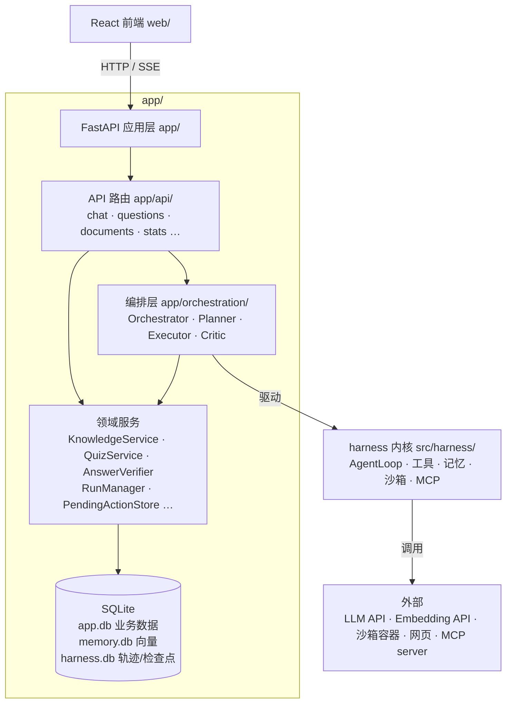
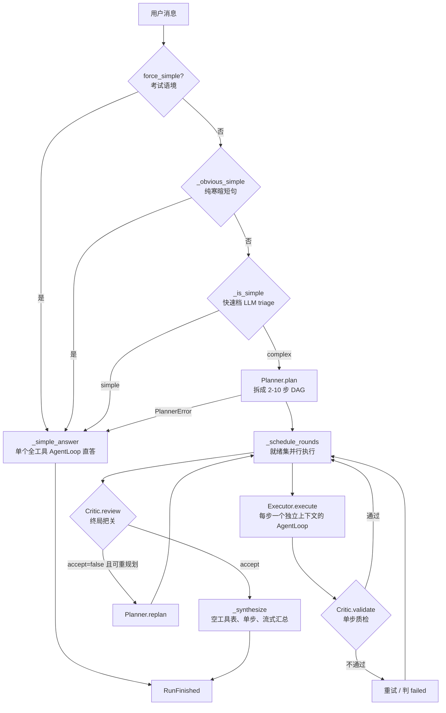
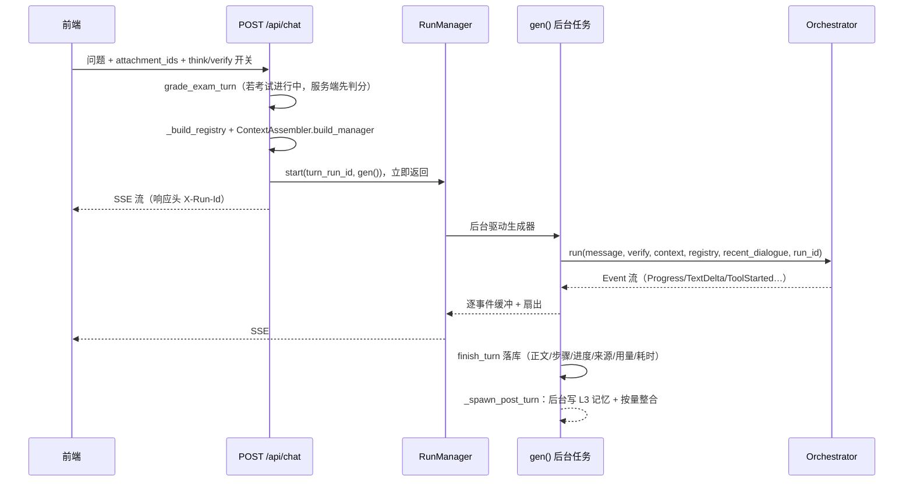

# 架构：app 层

> 面向想读懂代码结构的人。`app/` 是建立在 [harness 内核](architecture-harness.md) 之上的
> **Web 应用层**：用 FastAPI 暴露 HTTP/SSE 接口，把 Agent 内核包装成一个学习助手产品——
> 聊天、知识库、题库、错题、考试、下载产物、统计概览。
>
> 这份文档回答两个问题：**为什么这样分层**，以及**一次聊天请求的数据是怎么流的**。
> 每个说法都用文件路径 / 类名锚定，方便直接跳过去读代码。

## 分层总览



分层的取舍很直接：

- **harness 内核只管「模型 ↔ 工具」的循环**，不知道「学习助手」这回事——没有知识库、题库、
  用户这些概念。
- **app 层持有全部领域知识**，通过两条通道扩展内核：**注册工具**（`app/tools/`）和
  **注入上下文**（`app/context_assembly.py`）。内核零改动。
- **前端只通过 HTTP/SSE 说话**；生产模式下 `web/dist` 由 FastAPI 同源托管
  （`app/main.py` 末尾的 `spa_fallback`）。

## 装配：从配置到可用的后端

启动分两步。

### 1. `build_harness(config)` —— `app/assembly.py`

按配置组装出一个 `Harness` dataclass（字段见 `app/assembly.py` 顶部）：模型客户端、
全局工具表、检查点/轨迹存储、记忆、沙箱、技能、MCP 管理器、**编排器**。

工具按开关渐进注册（`_reg` / `_reg_exec` 两个内部函数）：

| 条件 | 注册的东西 |
| --- | --- |
| 恒定 | `CalculatorTool`、`UpdatePlanTool`、`SaveDownloadTool`、`http_request` |
| `api_key` 或 `embedding_api_key` | 记忆栈：`Memory` + `Retriever` + `MemoryWriter` + `MemoryMaintainer`，以及 `search_knowledge` / `search_memory` / `remember` / `recall_episodes` |
| `enable_sandbox` 且配了 `sandbox_docker_host` | `SandboxManager` + `SandboxProxy`，读写文件、`run_shell`、`run_python`（多镜像/多语言时再加 `run_node` / `run_java`） |
| `enable_browser` | `BrowseTool`，并给 `http_request` 挂上「抓不到就改用浏览器」的兜底 |
| `enable_dispatch`（默认 **False**） | `DispatchTool`，从 `agents/` 目录加载子 agent 名册 |
| `enable_skills` | `load_skill` / `unload_skill` / `read_skill_resource`（技能目录为空则整体跳过） |
| `enable_mcp` | 只**构造** `MCPManager`；真正连接与注册远程工具在 FastAPI startup 钩子里（`build_harness` 是同步函数） |

`enable_step_check`（默认 True）时，检索类与代码执行类工具会被 `app/tools/validating.py`
的 `ValidatingTool` 包一层：知识库检索包 `relevance_check`（空命中意味着本轮没有可引用依据），
联网抓取包 `web_content_check`（拦「抓到的是 example.com 这类占位空壳页」）。

**编排器是恒构建的**，没有开关。`app/assembly.py` 里那段注释写得很直白：
「已成为唯一主流程，恒构建、无开关」。它在这里被装上四个协作者，且各自绑定不同模型档位：

```
Orchestrator(
  planner  = Planner(主模型)          # 规划质量要求高
  critic   = Critic(主模型, validate_complete=快速档)   # 终局 review 用主模型，单步 validate 用快速档
  executor = Executor(快速档 client/model)               # 执行子步占往返大头，走快速档提速
  fast_complete / fast_client = 快速档                    # triage 与简单直答
  budget_factory = lambda: BudgetTracker(...)             # 每次 run 新建，单例并发安全
  skill_matcher = SkillMatcher(...)                       # 有技能才给
)
```

模型档位由 `app/completion.py` 统一产出：`build_completer`（主）、`build_fast_completer`
（快速档，恒关思考链）、`build_judge_completer`（裁判档，可指向独立端点/模型以降低自评偏差）、
`build_check_completer`（grounding 核对：主模型 + 关思考）、`build_fast_client`（要带工具循环时
用的 client 版）。**换模型只改配置，不动代码**。

### 2. `create_app(config, harness, …)` —— `app/main.py`

建 FastAPI 应用：各领域 Store 共享同一个 `app.db` 连接、装配领域服务、注册全部路由、
挂 startup/shutdown 钩子（MCP 连接、沙箱孤儿容器清扫与关停、`RunManager.close`）。
启动时还会调 `store.reconcile_streaming()`，把上次进程重启遗留的「生成中」消息标为中断。

## 主要部件

| 类别 | 文件 | 职责 |
| --- | --- | --- |
| **入口 / 装配** | `app/main.py`（`create_app`）、`app/assembly.py`（`build_harness`） | 建应用与内核 |
| **编排** | `app/orchestration/` | `Orchestrator` / `Planner` / `Critic` / `Executor` / `plan.py`（纯 DAG 数据结构与校验） |
| **API 路由** | `app/api/*.py` | chat、conversations、documents、questions、wrong_answers、attachments、downloads、stats、auth、profile、exam_status、pending_actions、mcp、models_info、version |
| **鉴权** | `app/auth.py` / `app/captcha.py` | 注册登录、令牌、图形验证码 |
| **会话与在途运行** | `app/conversations.py` / `app/run_manager.py` | 消息落库；后台任务 + 内存事件总线 |
| **上下文组装** | `app/context_assembly.py` / `app/context.py` / `app/summarizer.py` | L1 窗口 / L2 摘要 / L3 检索（见 [上下文管理](context-management.md)） |
| **记忆（应用侧）** | `app/conversation_memory.py` | 对话文本入向量库 + 语义召回 |
| **知识库** | `app/knowledge.py` / `app/parsing.py` / `app/documents.py` | 文档解析、切块入库、检索（见 [RAG 检索](rag-retrieval.md)） |
| **题库 / 考试** | `app/questions.py` / `app/quiz_service.py` / `app/question_import.py` / `app/exam_session.py` / `app/exam_flow.py` / `app/exam_grader.py` / `app/wrong_answers.py` | 出题、导入、服务端托管考试、判分、错题 |
| **回答校验** | `app/verify.py` | `AnswerVerifier`（format / grounding / code / facts / judge 五层）、`TrajectoryJudge` |
| **来源标注** | `app/sources.py` | `wrap_tool` 给工具包一层记源，正文内联 `[n]` 引用 |
| **待确认动作** | `app/pending_actions.py` + `app/api/pending_actions.py` | 破坏性删除的两段式确认 |
| **抓取黑名单** | `app/url_blocklist.py` | 抓失败的网址分级 TTL 登记，下次短路让模型换来源 |
| **模型档位** | `app/completion.py` | 主 / 快速 / judge / 核对 各档 completer |
| **应用侧工具** | `app/tools/` | `plan_tool`、`save_download`、`knowledge_tools`、`exam_tools`、`attachment_tools`、`validating` |
| **产物 / 统计 / 画像** | `app/downloads.py` / `app/stats.py` / `app/profile.py` | 下载文件、运行与计费统计、个性化偏好 |

## 数据存哪

三个 SQLite 文件（路径都可配，下面是默认值）：

- **`app.db`**（`config.app_db_path`）—— 业务数据：用户、会话与消息、文档、题库、错题、
  下载、考试会话、画像、待确认动作、抓取黑名单。
- **`memory.db`**（`config.memory_db_path`）—— sqlite-vec 向量库：知识库片段、对话记忆、
  任务经验。
- **`harness.db`**（`config.persistence_db_path`）—— Agent 运行留痕：检查点（续跑）与逐事件
  轨迹（排查、回看、统计）。

## Plan-Execute-Reflect：唯一主流程

`app/orchestration/orchestrator.py` 的 `Orchestrator.run()` 是所有聊天请求的实际控制器。
它**产出的事件类型与 `AgentLoop` 完全一致**（`RunStarted` / `Progress` / `TextDelta` /
`ModelUsage` / `RunFinished` / `RunError`），所以 SSE 序列化、前端渲染都不用改一行——
`app/api/chat.py` 直接把 orchestrator 当成一个 loop 对象喂给 `_drain()`。



几个容易读错的点：

**triage 是三段短路，不是一次判断。** 顺序写在 `Orchestrator.run()` 里：
`force_simple`（考试等有状态交互，由 chat 路由置真）→ `_obvious_simple()`（纯寒暄的正则，
零模型调用）→ `_is_simple()`（快速档 LLM，只回 simple/complex，判不了就当复杂）。

**「简单」不等于「没工具」。** `_simple_answer()` 起的是一个 **max_steps=10 的全工具
`AgentLoop`**，只是跳过了规划。它承载绝大多数流量（问答、追问、考试）。

**并行调度是按就绪集一轮轮推的。** `_schedule_rounds()` 用 `plan.py::ready_steps()`
取「自身 pending 且依赖全 done」的步骤，给每步起一个 `asyncio.Task`，事件经队列汇流；
某步崩溃被单独隔离，客户端断连时 `finally` 里统一 cancel，不留悬挂任务。

**反思分两层。** 单步层是 `Critic.validate()`（快速档，宽松务实）；整体层是
`Critic.review()`（主模型，可触发 `Planner.replan`，上限 `orchestrator_max_replan`）。
两者调用失败一律 **fail-open 放行**——判官抖动绝不该拦下一份好答案。

**残缺胜过空手。** 预算超限（`BudgetExceeded`）、无就绪步（依赖链断了）、零产物，
都不硬判 `RunError`：`_skip_unfinished()` 把剩余步标 skipped，带现有产物照样 `_synthesize`。
跨轮的 `all_artifacts` 在换 plan 前先收走，重规划不会丢掉已完成的成果。

**Planner 看到的工具清单，就是执行子步真正拿得到的那份。** `render_tool_roster()` 渲染的是
`exec_reg`（隐藏后的视图）而非裸 registry，否则规划器会编出「保存到 Notion」这类系统做不到
的步骤。`plan.py::validate_plan()` 再确定性地拦四类问题：空计划、id 重复、依赖不存在、成环，
外加三条可执行性约束——**不许规划「问用户」的步骤**（`_ASK_USER_RE`，因为计划一口气跑完、
执行子步没有与用户对话的通道）、**不许未经要求写入知识库**（`_SAVE_KB_RE`）、
**引用前置产出必须连依赖**（`_NEEDS_DEPS_RE`）。校验错误串会被拼进下一次提示驱动 Planner
重试（上限 `orchestrator_planner_max_retries`）。

**技能是「主动挂载」的，不等模型自觉加载。** `SkillMatcher`（`src/harness/skills/matcher.py`）
按触发词确定性匹配用户消息，命中的技能剧本被注入两处：Planner（当拆解蓝本）和简单直答
（当参考前缀），同时发一条 `Progress(scope="skill")` 让前端显示。命中技能的轮次**不做重规划**
——剧本本身就规定了拆法，重新拆解等于把它推翻，用户会看到步骤中途凭空变样；单步做砸仍由
`max_step_retry` 在原步骤内兜住。`force_simple`（考试）不叠加技能，剧本会干扰逐题推进。

**工具视图会按轮次收窄。** `app/orchestration/executor.py::HidingRegistry` 是对底层 registry
的**活视图**（不是静态拷贝，故 startup 才注册的 MCP 工具也能看见）。执行子步恒隐藏
`update_plan`（子步调它会覆盖总计划）；`save_to_knowledge` 则按需隐藏——只有用户消息里
出现过入库意图（`_KB_REQUESTED_RE`）或命中的技能剧本本就以入库为目的时才放开。

## 请求级装配：`_build_registry`

全局 registry 是**模板**，不是实际用的那份。`app/api/chat.py::_build_registry(user_id,
conv_id, has_attachments, exam_active)` 每个请求现建一份：

1. 复制 `harness.registry` 的全部工具，逐个过 `wrap_tool(guard_fetch_tool(t, url_block_store), sink)`。
   `guard_fetch_tool`（`app/url_blocklist.py`）只对抓取类工具生效、其余原样返回；`wrap_tool`
   （`app/sources.py`）给所有工具包一层记来源。顺序有讲究——guard 在内、记源在外，被短路的
   网址抛 `ToolError` 时异常先于记源逻辑抛出，故不会被记成「参考来源」。
2. **按用户覆盖同名工具**：`save_download`（按用户隔离下载目录）、`search_knowledge` /
   `search_memory` / `remember`（collection 换成 `knowledge:{user_id}` / `memory:{user_id}`）。
   不覆盖的话模型永远搜不到东西，还会连带让 grounding 校验形同虚设。
3. **按能力可用性追加**：`save_to_knowledge`、题库五件套、错题两件套、`start_exam`；
   附件工具只在本会话有过附件时才注册。
4. **按状态收窄**：考试激活时**不**暴露 `save_wrong_answer`——判分与错题保存已由服务端
   在 `app/exam_flow.py::grade_exam_turn` 里确定性完成，再给模型这把刀只会重复入库。
5. **删除类工具接上 pending_store**：`DeleteQuestionsTool` / `DeleteWrongAnswersTool` 拿到
   `pending_store` 和 `conv_id` 后，行为从「直接删」变成「登记一条待确认」
   （`pending_store` 为 None 时退回直接删除，仅见于精简装配/老测试）。

指引文本同样是每请求拼的（`base_ctx` 那一大串）：系统提示 + `CLARIFY_GUIDE` + 用户画像 +
`EXAM_GUIDE`（仅命中考试语境时，见 `_needs_exam_guide`，约省 60% 常驻窗口）+ `ATTACHMENT_GUIDE`
（仅有附件时）+ 沙箱指引（仅有沙箱时）+ `SOURCE_GUIDE` + 当前日期。**没注册的工具就不介绍**——
介绍一批模型没有的工具比浪费 token 更糟。

## 一次聊天请求怎么走完

聊天不是「请求-响应」，而是**后台任务 + SSE 订阅**：



关键机制：

- **并发守卫**：同一会话已有在途 run 时 `POST /api/chat` 直接 409
  （`run_manager.active_run_for_conv`）。
- **断点续传**：`RunManager`（`app/run_manager.py`）是进程内的 pub-sub 总线。每个 run 缓冲
  自己产生过的全部事件；`GET /api/chat/attach/{run_id}` 订阅时**先回放缓冲、再接实时**，
  刷新页面能无缝续上。请求断开只是取消订阅，后台任务照跑到完并落库。
  run 结束后有 60 秒宽限期才清理，供「完成瞬间刷新」的迟到 attach 回放。
  局限写在模块 docstring 里：内存态、单进程，多 worker 需粘性会话；进程重启会丢在途任务，
  由启动时的 `reconcile_streaming` 兜底。
- **停止**：`POST /api/chat/stop/{run_id}` → `RunManager.cancel` 取消后台 task →
  `gen()` 的 `except asyncio.CancelledError` 落「已生成部分 + status=stopped」。
- **用量分模型累计**：所有 `ModelUsage` 都是**逐模型增量**（编排器各子调用经
  `app/orchestration/usage_ctx.py::record_usage` 上报，embedding/rerank 也走同一条路），
  chat 路由的 `_drain` 按模型 key 累加，合计即本轮总额；同时经 `harness.sink` 落轨迹库
  供历史统计。
- **交付后不阻塞**：`RunFinished` 送出、状态落库之后，L3 记忆写入与记忆整合由
  `_spawn_post_turn` 丢进独立 task。此前直接 await 会让流迟迟不关、前端一直转圈，
  且该 run 仍算在途、用户连下一句都发不了。

### 关于 chat.py 里的另外两个分支

`app/api/chat.py::gen()` 里有 `if getattr(harness, "orchestrator", None) is not None:` /
`elif not gate_on:` / `else:` 三支。**只有第一支是正常路径**——`build_harness` 恒建
orchestrator，生产环境必定走它。后两支（ReAct 直通、ReAct + 交付门循环）是
**orchestrator 缺失时的惰性兜底**，主要服务于注入 `harness=SimpleNamespace(orchestrator=None)`
的精简测试。读代码时不要把它们当成三条并列的正常流程。

同理，`app/verify.py` 的 `AnswerVerifier` 交付门循环（缓冲 → 校验 → 回灌重答 → 清理未通过轮
的副作用产物）只在那条兜底分支上跑。编排器路径上「结果校验」这个前端开关映射到的是
**`Critic.review` 终局把关**（`req.verify` → `Orchestrator.run(verify=...)`）；
`AnswerVerifier` 在编排器路径下不参与；`TrajectoryJudge` 则仍会额外打一次分层质量分——
但要三个条件同时成立：`enable_trajectory_judge`（默认 **False**）、本轮工具步 > 1、本轮未出错。
它只落 `progress` 供「AI 运行统计 · 回答质量」展示，**不驱动重答**。

## 安全机制

两套机制，切入点完全不同。

### 危险 shell 命令 → 运行中人工审核

命令是 agent 要**当场执行**的，所以必须在工具执行内部阻塞等待。

- `src/harness/shell/policy.py::classify_command()` 用一份精选黑名单正则判定
  （`rm`、`mkfs`、`dd of=/dev/`、fork 炸弹、`curl | sh`、`sudo`、`>/etc/` 等），
  命中返回 `Danger(pattern, reason)`。它的 docstring 说得很清楚：这是**面向人工的启发式
  绊线，不是安全边界**——真正的边界是容器隔离（cap_drop=ALL、network=none、非 root、
  tmpfs 工作区、用后销毁）。判定刻意偏向多弹窗。
- `src/harness/approval.py::request_approval()` 先 `emit(ApprovalRequired)`（经
  `harness/progress.py` 的 emitter 并入 SSE），再 `await` 一个模块级全局 registry 里的
  `asyncio.Future`。用全局而非 contextvar，是因为决策来自**另一个 HTTP 请求**
  （`POST /api/chat/{run_id}/decision` → `harness.approval.resolve`），contextvar 桥不过去。
- 超时（`config.sandbox_approval_timeout`，默认 120 秒）自动拒绝。同一轮里被拒过的
  `(工具, 命令)` 记进 `ApprovalContext.denied`，后续同样请求直接拒——用户拒绝是人做出的
  决定，再问一遍不会有不同答案。编排器侧对应地把这类失败标成 `terminal`
  （`executor.py::_USER_DENIED_MARK`），单步不再重试。
- 没有审批上下文时（纯 harness / CLI / 测试）`request_approval` 直接放行，保持内核对
  「无人工通道」的场景透明可用。

### 破坏性删除 → 两段式确认

删题库题、删错题不是当场执行，而是**换执行者**。

原因写在 `app/pending_actions.py` 的 docstring 里：执行子步没有与用户对话的通道，工具描述里
那句「调用前必须先向用户取得确认」在主执行路径上**结构性地无法满足**——模型要么跳过确认
直接删，要么自称确认过了。

于是：`DeleteQuestionsTool` / `DeleteWrongAnswersTool` 拿到 `pending_store` 后只
`create()` 一条 pending 记录并把它交付给用户；真正的删除发生在
`app/api/pending_actions.py::confirm` 里（前端 `PendingActionCard.tsx` 上点确认）。
**执行者是 API，不是 agent**——这决定了本机制的成本：无需给计划做快照、也无需断点续跑，
本轮照常收尾即可。

防重复删除靠 `PendingActionStore.decide()` 的原子迁移：
`UPDATE … WHERE status='pending' AND expires_at>?` + `rowcount` 判定。用户连点两次，
只有第一次拿到记录，第二次得到 `None`；`confirm` 端点必须先 `decide` 再执行，顺序反过来
就会删两次。记录默认 24 小时过期（`DEFAULT_TTL_SECONDS`），过期在**读路径**上呈现为
`expired` 但不改库（状态迁移只发生在 `decide` 里，否则并发读会互相竞争写）。

## 前端（web/）

React + TypeScript + MUI + Vite。页面在 `web/src/pages/`：聊天 `ChatPage`、
知识库 `KnowledgeView`、题库 `QuestionBankView`、错题 `WrongAnswersView`、
下载 `DownloadsView`、首页概览 `HomeView`（学习主场 + `OverviewTab` / `AiStatsTab` 用量监控）。

聊天页消费同一条 SSE 流，按事件 scope 分流渲染（`web/src/components/`）：
`PlanBlock` 画计划树（`Progress(scope="plan")` 的 JSON，带 id 用于把 `executor:<id>` 的
执行明细挂到对应计划步下）、`ThinkingBlock` 展示思考、`SubagentProgress` / `ToolCallRows`
展示工具调用、`SourceList` 展示参考来源、`VerifyBadge` 展示校验状态、
`PendingActionCard` 展示待确认删除。

## 设计取向

- **一条主流程，不做并联开关**。编排器恒建恒走；简单问答在其内部短路成单个 ReAct 直答，
  不给简单场景加成本。
- **能力按开关渐进装配**。最小可跑只要一个 LLM key；沙箱、浏览器、MCP、技能、多智能体
  各自独立开关，没开就不注册对应工具，同一套代码能力可裁剪。
- **领域逻辑在 app，循环在 harness**。产品怎么变，尽量不动内核。
- **确定性的服务端兜底，不依赖模型自觉**。考试判分与错题入库在 `exam_flow.py` 里做完，
  不给模型留跳过的余地；破坏性删除的执行者换成 API；计划的可执行性约束由
  `validate_plan` 正则确定性拦截，而不是只写在提示词里。
- **旁路失败一律降级但不静默**。L2 摘要失败、判官抖动、交付门故障都不阻断交付，
  但都会打日志并记进 trace（`ctx_trace` / `verify_trace`），使「多少轮其实没真校验过」
  可被统计到。

## 代码入口

- 应用入口：`app/main.py::create_app`；`python -m app` 启动
- 内核装配：`app/assembly.py::build_harness`
- 聊天全链路：`app/api/chat.py::make_chat_router`（`gen()` 是那一轮的主体）
- 编排控制流：`app/orchestration/orchestrator.py::Orchestrator.run`
- 计划数据结构与校验：`app/orchestration/plan.py`（零 LLM、零 IO，可完全确定性单测）
