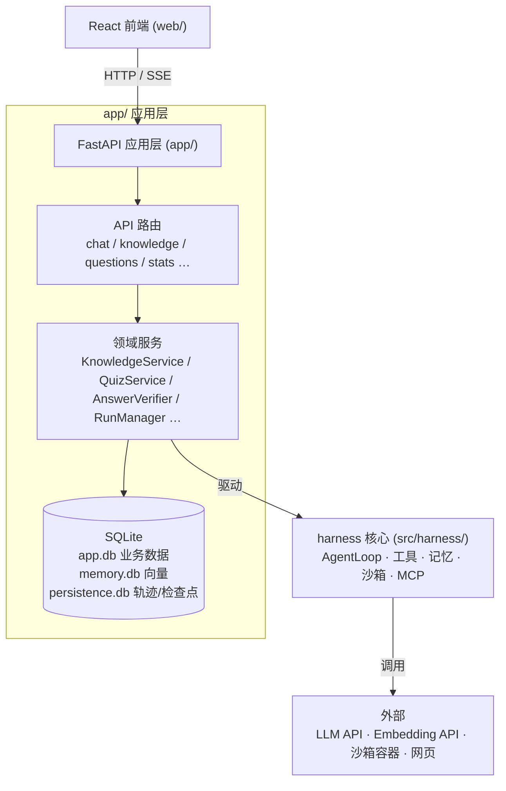
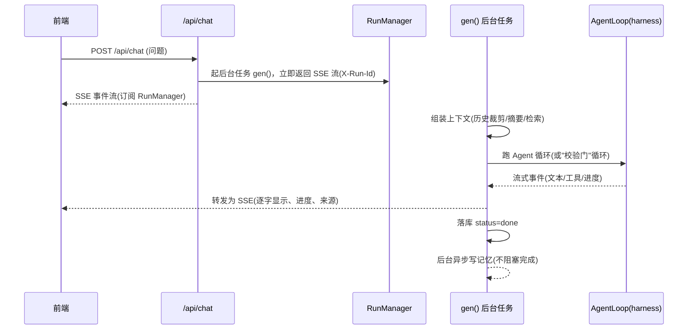

# 架构:app 层

> 面向第一次接触本项目的人。`app/` 是建立在 [harness 核心](architecture-harness.md) 之上的
> **Web 应用层**:用 FastAPI 暴露 HTTP 接口,把 Agent 内核包装成一个学习助手产品——聊天、
> 知识库、题库、错题、概览等。这份文档讲清:后端由哪些部件组成、一次聊天请求是怎么走完的。

## 分层总览

- **前端**只通过 HTTP/SSE 和后端说话;生产模式下前端构建产物由 FastAPI 同源托管。
- **应用层**负责鉴权、领域逻辑(会话/知识/题库…)、数据落库,并在需要时驱动 `harness` 跑 Agent。
- **harness 核心**只管 Agent 循环本身,不知道"学习助手"这回事。

## 装配:从配置到可用的后端

启动分两步,都在 `app/` 里:

1. **`build_harness(config)`**(`app/assembly.py`)—— 按配置组装出一个 `Harness`:
   - 建模型客户端(带重试)、注册工具(计算器/联网/记忆/沙箱/浏览器/派发/技能…)。
   - **按开关渐进装配**:配了 embedding key 才建记忆与 RAG;`enable_sandbox` 才注册跑代码工具;
     `enable_browser`、`enable_dispatch`、`enable_skills`、`enable_mcp` 各自控制对应能力。
     没开的能力就不注册对应工具——**同一套代码,能力可裁剪**。
2. **`create_app(config, harness, …)`**(`app/main.py`)—— 建 FastAPI 应用:
   - 创建各领域 Store(共享一个 `app.db` 连接)、装配领域服务、注册所有 API 路由。
   - 装配可选的回答校验门、轨迹 judge、断点续传管理器(`RunManager`);启动时对账残留的
     "生成中"消息(上次进程重启留下的)。

## 主要部件

| 类别 | 部件 | 职责 |
| --- | --- | --- |
| **入口/装配** | `main.py` / `assembly.py` | 建应用、装配 harness 与服务、注册路由 |
| **API 路由** | `api/chat.py` 等 | 聊天、会话、知识库、题库、错题、下载、统计、鉴权、版本、MCP |
| **鉴权** | `auth.py` / `captcha.py` | 注册登录、令牌、图形验证码 |
| **对话/会话** | `conversations.py` / `run_manager.py` | 会话与消息存储、在途生成的后台任务与事件总线 |
| **上下文组装** | `context_assembly.py` / `context.py` / `summarizer.py` | 每轮上下文裁剪/摘要/检索(见 [上下文管理](context-management.md)) |
| **记忆(应用侧)** | `conversation_memory.py` | 对话文本入向量库 + L3 语义召回 |
| **知识库(RAG)** | `knowledge.py` / `parsing.py` | 文档解析、去重、切块入库、片段检索(见 [RAG 检索](rag-retrieval.md)) |
| **题库/考试** | `quiz_service.py` / `question_import.py` / `exam_*.py` | 出题、判分、题库导入、模拟考试 |
| **回答校验门** | `verify.py` | 交付前对格式/grounding/代码/评分校验,不过则重答 |
| **模型档位** | `completion.py` | 主/快速/judge/核对 各档 completer(换模型只改配置) |
| **工具(应用侧)** | `tools/` | 任务清单、保存下载、知识库读写、附件读取等应用专属工具 |
| **产物/统计/画像** | `downloads.py` / `stats.py` / `profile.py` | 生成文件、学习与计费统计、个性化偏好 |

## 数据存哪

三个 SQLite 文件,各司其职:

- **`app.db`** —— 业务数据:用户、会话与消息、文档记录、题库、错题、下载、考试、画像等。
- **`memory.db`** —— 向量库(sqlite-vec):知识库片段、对话记忆、任务经验的向量。
- **`persistence.db`** —— Agent 运行留痕:检查点(续跑用)与逐字轨迹(排查/回看用)。

## 一次聊天请求怎么走完

聊天是最能体现全链路的路径。它不是"请求-响应",而是**后台任务 + SSE 流式**:

要点:

- **断点续传**:生成跑在脱离请求的后台任务里;刷新/断线后用 `X-Run-Id` 走 `/api/chat/attach`
  接回在途流,`/api/chat/stop` 可中止。进程重启也能对账残留消息。
- **回答校验门**(可选):开启后是"缓冲初稿 → 校验(格式/grounding/代码/评分)→ 不过带反馈重答"
  的循环,最多重答 N 次;详见 [上下文管理](context-management.md) 里提到的交付门相关设计与
  `app/verify.py`。
- **交付后不阻塞**:答案给出、状态置为已完成后,L3 记忆写入等收尾在**后台**跑,不拖着"转圈"。

## 前端(web/)

React + TypeScript + MUI + Vite。主要页面:聊天(`ChatPage`)、知识库(`KnowledgeView`)、
题库/错题、下载产物、首页概览(`HomeView` = 学习主场 + AI 用量/计费监控)。聊天页消费后端 SSE,
实时渲染流式正文、思考块、工具进度、任务清单、参考来源与校验徽章。

## 设计取向

- **能力按开关渐进装配**:最小可跑(只要一个 LLM key),沙箱/浏览器/MCP/多智能体按需开。
- **领域逻辑在 app、循环在 harness**:产品怎么变,尽量不动内核。
- **确定性的服务端兜底**:判分、错题入库、校验门等关键动作由服务端确定性执行,不依赖模型自觉。

## 代码入口

- 应用入口:`app/main.py`(`create_app`)、`python -m app` 启动
- 装配:`app/assembly.py`(`build_harness`)
- 聊天全链路:`app/api/chat.py`
- 各领域服务:见上表
