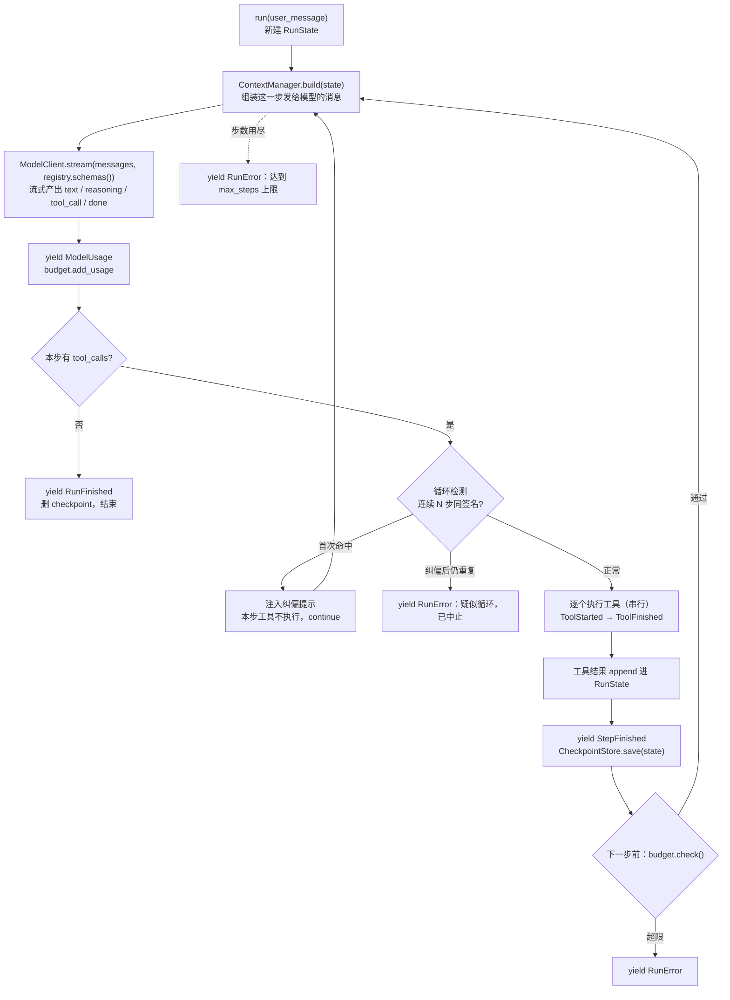

# 架构：harness 内核

> 面向想读懂代码结构的人。`harness`（`src/harness/`）是本项目自研的**最小 Agent 运行时内核**，
> 不依赖任何 Agent 框架。它只负责一件事：**驱动「模型 ↔ 工具」的循环**，并把整个过程以事件流
> 的形式吐出来。上层的 `app/`（见 [app 层架构](architecture-app.md)）把它包装成一个学习助手
> Web 服务。
>
> 这份文档讲的是**模块怎么切、数据怎么流、边界划在哪**，不是 API 手册。

## 一句话理解

大模型本身只会「输入文字 → 输出文字」。要让它**动手做事**，需要一个循环：模型说「我要调用某
工具」，程序执行它，把结果回喂给模型，如此往复直到它不再要求调工具。这个循环就是
`src/harness/loop/agent_loop.py::AgentLoop`。

## 核心：AgentLoop



一「步」（step）= 一次模型调用 + 若干次工具执行。几个容易读错的实现细节，都在
`AgentLoop._run_from()` 里：

- **异常一律转成事件，不向调用方抛。** 模型调用失败 → `RunError("模型调用失败: …")`；
  预算超限（`BudgetExceeded`）→ `RunError`；**步数用尽也是 `RunError`**，不是抛异常。
  消费方只需要处理事件流。
- **工具是串行执行的。** 第 240 行是普通的 `for f in finalized:` + `await`，没有
  `asyncio.gather`。需要并行的场景由上层自己编排（app 的 `_schedule_rounds` 正是这么做的）。
- **预算检查在步开头**，`budget.add_usage()` 在模型调用之后。所以**单步内可以超支**，
  只保证下一步不再开始。
- **检查点在步边界存**（`StepFinished` 之后），`RunFinished` 时删除。
- **循环检测是两段式，不是一命中就杀。** `loop_detect_window >= 2` 时，把每步的
  `(工具名, 规范化参数)` 组成签名（`_canonical_args` 用 `json.dumps(sort_keys=True)`，
  键序与空白无关）。连续 N 步签名全同：**第一次只注入纠偏**——给本步的 tool_calls 回填
  「检测到重复调用，已跳过本次执行。」保持消息合法，再追加一条系统提示让模型换思路，
  本步工具**不真执行**；纠偏后仍重复才 `RunError` 中止。
- **参数解析失败也走自纠正。** `_finalize()` 把跨 chunk 累积的 JSON 片段解析成 `ToolCall`，
  失败时记 `parse_error`，回填一条「参数不是合法 JSON，请重新调用」的错误结果喂回模型。

`resume(run_id)` 从 `CheckpointStore` 载入 `RunState` 续跑，步号天然接着走
（`range(state.step + 1, max_steps + 1)`）。**已知限制写在 docstring 里**：从上一个完整步的
下一步重跑，中断在半步则整步重跑，其中的有副作用工具（`write_file` / `run_shell`）可能被
**重复执行**——调用方需保证幂等或自行去重。

## 一切皆事件

`AgentLoop.run()` 不返回结果，而是**异步产出一串事件**（`src/harness/events.py`）。这是内核与
上层解耦的关键：上层只消费事件，不关心循环内部。

| 事件 | 关键字段 |
| --- | --- |
| `RunStarted` | `run_id` |
| `StepStarted` / `StepFinished` | `step` |
| `TextDelta` | `text`（正文增量） |
| `ReasoningDelta` | `text`（思考链增量，如 Qwen3 的 `reasoning_content`） |
| `ToolCallRequested` | `tool_calls: list[ToolCall]` |
| `ToolStarted` / `ToolFinished` | `tool_call` / `result` |
| `RunFinished` | `message`（最终 assistant 消息） |
| `RunError` | `error` |
| `ModelUsage` | `usage, cost_usd, attempts, latency_ms, model` |
| `ApprovalRequired` / `ApprovalResolved` | `run_id, approval_id, tool, command, reason` / `approval_id, approved, reason` |
| `Progress` | 见下 |

**单步内的事件顺序**：`StepStarted` → `TextDelta*` / `ReasoningDelta*` → `ModelUsage` →
（`RunFinished` 结束）或 `ToolCallRequested` →（`ToolStarted` → `ToolFinished`）×N →
`StepFinished`。

### Progress 与旁路上报

`Progress` 是**执行过程中的旁路进度**，字段语义（`events.py` 第 66-73 行）：

- `scope` —— 归属域。内核里出现的有 `"sandbox"`、`f"subagent:{agent}"`、`"skill"`、`"check"`；
  app 层还借这条通道传 `"plan"` / `"verify"` / `"sources"` / `"quality"` 等。
- `status` —— `"running" | "ok" | "error"`。
- `key` —— **步骤合并键**（通常是工具调用 id），前端据此把同一步的开始/完成折叠成一行。
- `agent` —— 归属子 agent 名，由 `emit()` 自动打标。
- `detail` —— `{tool, args, result, is_error}`，供前端展开。

问题在于：工具的 `run()` 只能返回字符串，**没法 yield 事件**。所以有了
`src/harness/progress.py`——用 contextvar 存一个 emitter，工具内部调 `emit(event)` 就能把进度
插进主事件流。`set_current_agent()` 期间，`scope=="sandbox"` 且未打标的事件会被**自动补上
当前 agent 名**。**未设 emitter 时 `emit()` 是 no-op**——纯 harness / CLI 场景照常可用。

## 子系统一览

| 子系统 | 目录 | 职责 |
| --- | --- | --- |
| **循环** | `loop/` | `AgentLoop`：主循环与 `resume` |
| **模型客户端** | `llm/` | `ModelClient` Protocol；`OpenAICompatibleClient` 做归一化 |
| **工具** | `tools/` | `Tool` / `ToolRegistry` / `ToolExecutor` + `tools/builtins/` 内置工具 |
| **上下文** | `context/` | `ContextManager`（扩展点）、`WindowStrategy`、`ContextBudget`、`ClampedContextManager` |
| **记忆** | `memory/` | 向量存储、多路检索、智能写入、整合（见 [记忆管理](memory-management.md) / [RAG 检索](rag-retrieval.md)） |
| **持久化** | `persistence/` | `CheckpointStore`（续跑）、`TrajectoryStore` + `TrajectorySink`（轨迹留痕）、`serialize` |
| **沙箱** | `sandbox/` | `Sandbox` Protocol + `LocalSandbox` / `DockerSandbox` / `RoutingSandbox` |
| **浏览器** | `browser/` | Playwright 抓取需要 JS 的网页；可下沉到容器内跑 |
| **网络策略** | `net/` | SSRF 防护（`check_url`）、容器内 DNS 解析 |
| **MCP** | `mcp/` | 接入外部 MCP 工具服务（stdio / streamable-http） |
| **技能** | `skills/` | 渐进式披露：按需加载技能说明与资源 |
| **多智能体** | `orchestration/` | `DispatchTool`：把子任务派给专职子 agent（限深） |
| **可靠性** | `reliability/` | `BudgetTracker` 预算、`RetryingModelClient` 重试 |
| **可观测** | `telemetry/` | OpenTelemetry 埋点（未装 provider 时零开销） |
| **审批** | `approval.py` | 检出危险命令 → 发 `ApprovalRequired` 等人工确认 |
| **旁路进度** | `progress.py` | contextvar emitter，让工具能往主流插事件 |
| **基础类型** | `types.py` / `state.py` / `usage.py` / `config.py` | 消息与工具调用、运行状态、token 与计费、配置 |

## 工具：统一契约

`src/harness/tools/base.py` 三个类，加起来 83 行：

```
Tool（ABC）           name / description / Params(BaseModel) / async run(params) -> str | ToolOutput
                     schema() 由 Params.model_json_schema() 自动生成 OpenAI function 格式
ToolRegistry         register / unregister / get / tools() / schemas()
ToolExecutor         execute(call) -> ToolResult
```

**新增一种能力 = 写一个 `Tool` 子类并注册，循环完全无感知。**

`ToolExecutor.execute()` 把所有失败都兜成 `is_error=True` 的 `ToolResult` 喂回模型自纠正，
**从不向 loop 抛异常**：未知工具、参数校验失败（`ValidationError`）、工具内部异常
（前缀「工具执行出错: 」）。例外是 `ToolError`——工具**主动**标记本次失败时，内容原样回传，
不加前缀，便于工具自己控制对模型说什么。

内置工具（`src/harness/tools/builtins/`）：

| 文件 | 工具名 |
| --- | --- |
| `calculator.py` | `calculator` |
| `fs_tools.py` | `write_file` / `read_file` / `list_files` |
| `shell_tool.py` | `run_shell` |
| `code_tool.py` | `run_python` / `run_node` / `run_java` |
| `http_tool.py` / `sandbox_http_tool.py` | `http_request`（宿主直连 / 沙箱内 curl，同名替换） |
| `browse_tool.py` | `browse` |
| `memory_search.py` | `search_knowledge` / `search_memory` |
| `memory_write.py` | `remember` |
| `episode_tools.py` | `recall_episodes` / `record_episode` |

另有三处工具不在 builtins 下：`skills/tools.py`（`load_skill` / `unload_skill` /
`read_skill_resource`）、`orchestration/dispatch.py`（`dispatch`）、`mcp/tool.py`（`McpTool`，
工具名来自远程 server）。

## 模型客户端：分层包装

```
AgentLoop
  └─ RetryingModelClient        # 瞬时错误自动重试（指数退避 + 抖动）
       └─ OpenAICompatibleClient   # 把消息 + 工具 schema 变成归一化的流式 chunk
            └─ 任意 OpenAI 兼容端点（OpenAI / 千问 Qwen / DeepSeek / 自建 vLLM …）
```

`src/harness/llm/base.py` 的 `ModelClient` 是个 `Protocol`，**只有一个方法**：
`async stream(messages, tools) -> AsyncIterator[StreamChunk]`。`StreamChunk.type` 取
`"text" | "reasoning" | "tool_call" | "done"`，usage 与 attempts 只在 done chunk 上携带。
因为是 Protocol，`RetryingModelClient` 装在外面 loop 完全无感知。

`OpenAICompatibleClient` 的归一化职责（它的 docstring 明说「不做重试、不做路由」）：

- 消息转换（含多模态 content-parts 透传）、tool_calls 归一成 `ToolCallDelta`；
- **`reasoning_content` 单独走 `type="reasoning"`**，不混进正文；
- **usage 兜底**：端点没回 usage 就用 tiktoken 估算，保证计费口径不断；
- **空产出留证**：既无 text 又无 tool_call 时打 warning 并带上 `finish_reason`——
  content_filter、截断这类静默失败靠它定位。

三个厂商适配设施值得单列：

- `set_extra_body_override()` / `get_extra_body_override()`（contextvar）—— 按请求覆盖
  `extra_body`，不必把参数一路穿过 `AgentLoop`。
- `json_output()`（context manager）—— 强制 `response_format={"type":"json_object"}`。
  它要求顶层是 JSON **对象**，所以调用点都用 `{"items":[...]}` 信封。
- `_adapt_thinking()` —— 把**厂商中立**的 `enable_thinking(bool)` 翻译成各家参数：
  DeepSeek → `thinking={"type": …}`，Qwen/百炼保持 `enable_thinking`，命中
  `thinking_unsupported_models` 子串则整个删掉。判定**模型名优先、再看 base_url**
  （统一网关下 base_url 判不出厂商）。

`RetryingModelClient`（`reliability/retry.py`）有一条核心安全约束：
**只在流尚未产出任何 chunk 前失败才重试**（`if produced or attempt > max_retries: raise`）——
中途断裂直接抛，否则消费方会收到半截输出再收到重发的完整输出。重试次数写回 done chunk 的
`attempts`，并作为 span event 记进当前 trace。

`BudgetTracker`（`reliability/budget.py`）是纯累计器：`start()` **幂等**（多 agent 共享同一个
budget 时全树只设一次墙钟基准），`add_usage()` / `check()`，超限抛 `BudgetExceeded`。
有个陷阱写在 docstring 里：**未调 `start()` 时墙钟检查被静默跳过**。

因为只依赖「OpenAI 兼容」这一契约，**换模型 / 换厂商只改配置**（`base_url` / `model` /
`api_key`），代码不动。上层据此做出主 / 快速 / judge / 核对四档（见 `app/completion.py`）。

## 上下文：内核最重要的扩展点

`src/harness/context/manager.py` 的 `ContextManager` 只有 18 行，`build(state)` 就一行：
`[system 消息, *state.messages]`。docstring 写明了意图——「build() 是纯函数，未来的裁剪/压缩/
RAG 注入都在这里加，loop 无感知」。

它没有基类、没有接口声明，靠**鸭子类型**扩展：任何暴露 `build(state) -> list[Message]` 的
对象都能塞进 `AgentLoop`。内核自带两个装饰器，app 层还有一批（`ConversationContextManager` /
`LayeredContextManager`）：

- `skills/context.py::SkillContextManager` —— 注入技能索引与已加载技能正文。
- `context/clamp.py::ClampedContextManager` —— 按 `(model, max_prompt_tokens)` 确定性硬裁：
  先从 index 1 起丢最旧的中间消息（**保 system 首条与本轮末条**），仍超则对末条文本
  **保头保尾砍中段**。之所以砍中段而不是砍尾：judge 类输入的末尾常是「只输出 JSON {…}」的
  格式指令，砍掉就废了。

另外两块是给上层算预算用的（app 的 `ContextAssembler` 直接调）：

- `context/windowing.py::WindowStrategy.select()` —— L1 滑动窗口，返回 `(kept, evicted)`。
  **切割只落在干净的 user 边界**，绝不从一轮中间切开——否则会留下孤儿 tool 结果或
  tool_calls 被截断的 assistant，OpenAI 直接 400。
- `context/budget.py::ContextBudget` —— 区分两类上限：`context_window` / `response_reserve`
  是**物理**约束（塞不下会报错，reserve 还要算上思考链），`max_prompt_tokens` 是**策略**
  约束（塞得下但不划算，典型是分档计价阈值）。

## 记忆

`memory/` 是内核里最大的子系统。分层看：

```
Memory（memory.py，门面）
  ├─ chunker.py     切块（markdown / code / text 三态）
  ├─ embeddings.py  EmbeddingClient Protocol + OpenAI 兼容实现
  ├─ backend.py     MemoryBackend Protocol ← 可替换切点
  │    └─ sqlite_backend.py  SqliteVecBackend（sqlite-vec）
  └─ retriever.py   多路召回 + 融合 + 重排
```

**`Retriever.retrieve()` 的流程**（`memory/retriever.py`）：

1. `QueryPlanner.plan(query)` —— **一次** LLM 同时出多查询改写、HyDE 假设文档、实体键
   （带 `query_plan_timeout_s` 超时，因为它卡在聊天首字的关键路径上；失败降级为空规划）。
2. 批量 embedding 一次算完（原查询 + 各改写 + HyDE 文档）。
3. 多路召回：向量（必）→ 关键词（`use_keyword`）→ 每条改写各一路 → HyDE 一路 →
   实体键精确取一路。
4. `rrf_fuse` 融合各路排名 → min-max 归一。
5. 加权打分：`w_relevance × 相关性 + w_recency × 时间衰减 + w_importance × 重要度`，
   时间衰减是半衰期公式 `0.5 ** (age_days / half_life_days)`。
6. `use_mmr` → `mmr_select` 做多样性重排（贪心 `λ·rel − (1−λ)·max cos`）。
7. `reranker.rerank()` —— 默认 `NoOpReranker`，配了端点才是 `HttpReranker`。

`RetrievalConfig` 的三路查询增强（`use_entity_recall` / `use_multi_query` / `use_hyde`）
**默认全关 = 零行为变更**，且都需要注入 `complete`。

**`MemoryWriter`（writer.py）的智能写入**分四阶段：`_extract`（LLM 提炼成结构化事实）→
`_gather_candidates`（实体键精确取 + 语义检索取）→ `_reconcile`（判 `ADD` / `NOOP` /
`REPLACE`）→ `_apply`（REPLACE 时先取版本号再 `set_superseded` 作废旧记忆）。

两个值得知道的设计：**提炼与调和可以配不同模型**——提炼是机械活可以便宜，调和是判断题且
**后果不可逆**（判 REPLACE 会永久作废旧记忆），装配层因此给它主模型。**降级都会出声**：
调和输出解析失败会「退化为全部 ADD」并打 warning，`write()` 末尾还会记一行
`{ADD/NOOP/REPLACE}` 判定分布——有候选却清一色 ADD，说明调和其实在空转。

**`MemoryMaintainer`（maintainer.py）** 做整合：贪心聚类（簇内平均余弦 ≥ `sim_threshold`）→
每个够大的簇用 LLM 蒸馏成**一条** semantic → `set_superseded` 作废簇内全部 episodic。
**带补偿回滚**：supersede 失败就删掉刚写的新记录，保持原子。`maintain()` = 清过期 + 整合。

`episodic.py` 的 `EpisodeRecorder.wrap(events, task)` 是事件流包装器：透传事件，
`RunFinished` → 成功、`RunError` → 失败，**落库放在 `finally`**——消费者收到终止事件后 break
导致生成器被 aclose 时仍会执行，不丢记录。

> **历史遗留双轨**：`memory/store.py::MemoryStore` 是旧实现（`memory_items` +
> `memory_vectors` 两表，filter 是**查后过滤**）；`memory/backend.py` + `sqlite_backend.py`
> 是新实现（`memory_vec` 以 `owner_id` 做 partition key，**filters 下推进 KNN**，另有 FTS5 表）。
> 桥接在 `memory.py::collection_to_scope()`，把旧的 `"<kind>:<owner>"` 字符串翻译成
> `(owner_id, kind)`；`Memory.search()` 为了让消费方零改动，仍返回旧的 `store.MemoryHit`
> 形状，`distance` 用 `1.0 - score` 伪造——**它不是 cosine 距离，只保留「越小越相关」的序**。
> `migrate.py` 提供旧库到新 schema 的迁移。

## 沙箱

`sandbox/base.py` 的 `Sandbox` 是 `@runtime_checkable Protocol`：`workspace` 属性 +
`start / close / exec / write_file / write_bytes / read_file / list_files`。
`resolve_in_workspace()` 用 `os.path.realpath` 双向比较拦截 `../`、绝对路径和**符号链接**逃逸。

三个实现：

- **`LocalSandbox`** —— 临时目录 + 子进程。docstring 明说「仅测试/离线开发用，**不是安全边界**」。
- **`DockerSandbox`** —— 直连 Docker daemon 的 TLS 端口（不走 SSH）。安全约束由
  `factory._docker_for` 传入：非 root 用户、`network`、`mem_limit`、`cpus`、`pids_limit`、
  `read_only`。文件传输走 tar 打包。`archive_workspace` / `extract_workspace` 用于把子沙箱
  产物回传基础容器。
- **`RoutingSandbox`** —— 一个容器只能一个镜像，「按语言选镜像」就必然是多容器。它持有
  `语言 → 镜像` 表，惰性启动 + 按语言缓存（`asyncio.Lock` 防并发首调重复创建）；
  **协议方法全部委托给「默认语言容器」**，使 shell / 文件 / http 工具零改动共用同一工作区，
  代码工具则通过额外的 `sandbox_for(language)` 取语言专属容器。
  **已知限制**：语言容器与默认容器的工作区是各自独立的 tmpfs，**互不可见**。

`build_sandbox(config, labels)`（`factory.py`）按 `sandbox_backend` 与 `sandbox_images` 三分支
选择实现。`labels` 打到容器上标记会话归属，供重启后回收孤儿容器。

## 技能：渐进式披露

技能 = `<skills_dir>/<name>/SKILL.md`（frontmatter 需 `name` + `description`，可选 `triggers`）
外加可选的 `scripts/` 与 `refs/`。`SkillRegistry` **启动时扫描一次，之后只读**——进程内单例、
天然并发安全；畸形 SKILL.md 记 warning 跳过，不抛异常。

「渐进式披露」落到三级：

1. **元数据索引常驻** —— `index_text()` 只吐「名 + 一句话描述 + 三个工具的用法」，便宜地进
   系统提示。
2. **正文按需加载** —— 模型调 `load_skill(name)` 后，正文才被注入。
3. **资源再下一层** —— `read_skill_resource(skill, path)` 读 `scripts/` / `refs/` 下的文件，
   受 `skill_resource_max_chars` 限制，并有路径穿越防护（`abspath` + `startswith(base + sep)`）。

实现上有个漂亮的设计：**`LoadSkillTool.run()` 实际不改任何状态**，只校验存在性、发一个
`Progress(scope="skill")` 并返回一句话。真正的注入由 `SkillContextManager.build()` 下一轮完成，
而它调的 `resolve_loaded_skills(state, registry)` 是**纯函数**——加载状态的唯一真相是消息历史
本身（扫历史里的 `load_skill` / `unload_skill` 调用）。**无共享可变态，天然并发安全，
随 run 结束自动重置。** 索引与正文都折叠进**单个** system 消息，避免多 system 消息的
provider 兼容性问题。

`skills/matcher.py::SkillMatcher` 记录了一个实测发现：**模型几乎从不主动 `load_skill`
（0/440 次调用）**。所以补了一条路由层「主动挂载」通路——纯关键词子串匹配（零 LLM 成本），
返回触发词命中最多的技能，平局取名字字典序靠前者保证结果稳定。上层的编排器用它把命中的技能
剧本注入 planner 与直答，而不是等模型自觉加载。

## 多智能体：DispatchTool

`orchestration/dispatch.py::DispatchTool`（工具名 `dispatch`，参数 `{agent, task}`）把子任务派
给专职子 agent。**这是可选能力，`enable_dispatch` 默认 `False`**（定义在
`app/config.py`——注意所有 `enable_*` 总开关都在 `AppConfig`，`HarnessConfig` 里只有
`enable_rerank`）。

- **角色定义**：`roster_loader.load_roster(agents_dir)` 从 `agents/*.yaml` 每文件读一个
  `AgentSpec(name, description, system_prompt, tool_names)`。**纯解析 + 结构校验，不涉及工具池
  过滤**（与工具池的耦合留在装配层）；畸形文件跳过并记 warning，绝不抛异常，保证启动不因配置
  错误而崩。
- **子 agent 怎么建**：`_build_sub_registry()` 新建空 `ToolRegistry`，按 `spec.tool_names` 从
  装配层传入的工具池字典里挑（取不到就静默跳过），再起一个
  `AgentLoop(client=同一个, context=ContextManager(spec.system_prompt), max_steps=sub_max_steps,
  budget=同一个)`。**client / budget / tracer 全树共享**，所以 token 预算是整棵树累计的——
  这正是 `BudgetTracker.start()` 要幂等的原因。
- **限深**：顶层 `DispatchTool` 由调用方直接注册到主 loop，**不受 `max_depth` 约束**；
  仅当 `depth + 1 < max_depth` 时才向子 registry 注入下一层 `dispatch`。
- **进度**：`set_current_agent()` + `scope=f"subagent:{agent}"`，用 `key=tool_call_id` 让前端把
  同一步折叠成一行。子 agent 没产出 `RunFinished` 就 `raise RuntimeError`，被 `ToolExecutor`
  兜成 `is_error` 回给父 agent。

## 审批：危险命令的人工确认

架构难点写在 `approval.py` 的 docstring 里：决策来自**另一个 HTTP 请求**，与被阻塞的工具协程
在同一事件循环但**不同 task / 请求上下文**，contextvar 桥不过去。所以用两套状态：

- **模块级全局** `_pending: dict[approval_id, asyncio.Future]` —— 跨请求的回传通道。
- **contextvar** `_ctx: ApprovalContext(run_id, timeout, denied)` —— 本次运行的审批上下文。

`request_approval(tool, command, reason)` 的流程：**先 `emit(ApprovalRequired)` 再 `await`
Future**（顺序关键，事件要先进 SSE 让前端弹窗），`asyncio.wait_for` 到 `timeout`。
端点侧 `resolve(approval_id, approved)` 完成 Future。

三个行为约定：

1. **无审批上下文（纯 harness / CLI / 测试）→ 直接放行返回 True**，保持内核对「无人工通道」
   的场景透明可用。
2. **超时 → 自动拒绝**。
3. **`ctx.denied` 去重** —— 用户拒绝是人做出的决定，同一条命令再问一遍不会有不同答案，
   只会把弹窗怼到用户脸上第二次、第三次（注释直接点名「编排器的单步重试正是这么干的」）。

切入点在**工具内部**，不在 loop 里——目前唯一的调用方是 `RunShellTool.run()`。判定由
`shell/policy.py::classify_command()` 做：16 条正则的精选黑名单（`rm` 系列、`mkfs`、
`dd of=/dev/`、fork 炸弹、`chmod 777 /`、`shred`、`curl | sh`、`sudo`、`> /etc/` 等），
命中首个即返回 `Danger(pattern, reason)`。它的定位很清楚：**面向人工的启发式绊线，
不是安全边界**——真正的边界是容器隔离；判定**有意偏向多弹窗**，对引号/转义等边角不追求精确。

被拒绝后的处理是个对抗性设计（`shell_tool.py`）：注释记录了实测发现——**模型会在安全关键
动作上撒谎**，照着预期编出「目录已删除」这类根本没发生的结果。所以做了双保险：软约束是
`ToolError` 文案把「该怎么向用户交代」也说死；硬保险是 `emit(Progress(scope="check",
status="error"))` 落库，即便正文谎称已删除，用户也能在同一条消息上看到「被拒绝、未执行」。

## 持久化

两张表，都在 `config.persistence_db_path` 指向的库里（默认 `harness.db`）：

| 类 | 表 | 内容 |
| --- | --- | --- |
| `CheckpointStore` | `checkpoints(run_id PK, state, step, updated_at)` | `RunState` 全量快照，`INSERT OR REPLACE` |
| `TrajectoryStore` | `trajectory_events(run_id, seq, type, data, created_at)` | 逐事件留痕，PK 是 `(run_id, seq)` |

`TrajectorySink.wrap(events, run_id=None)` 是事件流包装器：透传 + 按序落库。`run_id` 通常从
`RunStarted` 捕获；**resume 段不发 `RunStarted`**，所以调用方得显式传，此时用 `next_seq()`
续号把恢复段追加到原轨迹之后而不是覆盖。

`serialize.py` 提供双向的 `message_to/from_dict`、`runstate_to/from_dict`，以及**单向**的
`event_to_dict(ev) -> {"type": 类名, "data": {…}}`——app 层的 SSE 直接用它。

## 内核与应用的边界

**内核不知道任何应用概念。** 没有「知识库」「题库」「用户」「会话」，只有消息、工具、事件、
记忆记录。这不是口号，可以验证：

```
grep -rE "^\s*(from|import)\s+app(\.|\s|$)" src/harness/   →  零命中
```

依赖方向严格单向：`app/config.py` 里 `AppConfig(HarnessConfig)`，反过来没有。

应用扩展内核只有两条通道：

1. **注册工具** —— 写 `Tool` 子类塞进 `ToolRegistry`。`app/tools/` 下的 `SaveToKnowledgeTool`、
   `StartExamTool`、`SaveDownloadTool` 都是这么接进来的，`AgentLoop` 一无所知。
2. **注入上下文** —— 实现 `build(state) -> list[Message]` 的对象直接替换 `ContextManager`。
   app 的分层上下文（历史窗口 + 摘要 + 检索）全在这一层，内核零改动。

内核里有**四处同构的「无上下文即透明」设计**，正是这条边界得以成立的机制：

| 机制 | 上下文缺失时 |
| --- | --- |
| `progress.emit()` | no-op |
| `approval.request_approval()` | 直接返回 True 放行 |
| `telemetry.get_tracer()` | OTel 返回 no-op tracer，零开销 |
| `SkillContextManager.build()` | registry 为空时透明透传 inner |

> **一条显式的跨层契约**：知识库空命中的哨兵文案由内核常量 `NO_KNOWLEDGE_HIT`
> （`tools/builtins/memory_search.py`）单点定义并导出。app 层的
> `app/tools/validating.py::NO_HIT_MARK` 与 `app/verify.py::_NO_HIT` 都从此导入，
> 不再各自重抄字面量。
>
> 为什么值得收口：app 靠认出这串文字来判断「这次检索什么也没查到」。若各处抄一份，
> 改内核文案时 app 侧会**静默**失效——相关性校验永远判通过、grounding 把空结果当成
> 有依据，且不会有任何报错。`tests/test_sources.py` 有护栏禁止在生产代码里重抄它。

### 新工具该放哪:`harness/tools/builtins/` 还是 `app/tools/`

两处都有工具目录,判据是**这个工具离开学习助手还有没有意义**:

- **`src/harness/tools/builtins/`** —— 与业务无关的通用能力:算术、抓网页、发 HTTP、
  跑代码、读写文件、检索记忆。换个产品照样能用。
- **`app/tools/`** —— 学习助手的领域工具:题库、错题集、知识库、附件、下载区。
  离开这个产品就没有意义。

有个很硬的经验判据:看构造函数要什么。`app/tools/*` 几乎都要 `user_id`、
`question_store`、`download_store` 这类**应用态**;`harness/tools/builtins/*` 不需要。
**带用户态或业务存储的,一律归 app。**

## 分层:harness 是库,app 是它的消费者

两者**不是平级模块**。`pyproject.toml` 里只有 `packages = ["src/harness"]` 会被打包
——发布出去的产物是 `harness`(一个可分发的 Agent 运行时内核),`app/` 不在其中,
它是建于其上的第一个应用。`skills/`、`web/`、`evals/` 同理,都属于 app 层。

**依赖方向必须单向:`app` → `harness`,反向零依赖。**

这条线由 `tests/test_architecture_layering.py` 用 AST 扫描钉死:`src/harness/**` 里
出现任何 `import app` / `from app.x` 即测试失败。它靠人自觉是守不住的——随手写一句
`from app.config import AppConfig` 就能把内核焊死在这个产品上,而且运行时不会有任何
报错,只有发布时才发现打出来的包 import 不动。

内核确实需要感知上层的东西时,走**鸭子类型或回调注入**(见下方设计原则),不要反向 import。

## 几条设计原则

- **一切皆事件**。内核只管产出事件，UI、统计、落库都在上层消费，互不牵连。同一套事件也让
  app 的编排器可以**冒充成一个 AgentLoop**（它产出完全相同的事件类型），前端零改动。
- **异常不外泄，一律转成事件或 `is_error` 结果**。工具报错喂回模型自纠正，循环出错吐
  `RunError`，调用方只处理一种东西。
- **鸭子类型扩展，内核保持最小**。`ContextManager` 无基类、`ModelClient` / `Sandbox` /
  `MemoryBackend` / `Browser` / `Reranker` / `EmbeddingClient` 都是 `Protocol`——替换实现不用继承。
- **优雅降级，但不静默**。检索增强、重排、摘要、审批、遥测缺了都能跑；但会退化的地方基本
  都带 warning 日志或诊断行（记忆调和退化为全 ADD、空产出留 `finish_reason`、检索一行统计）。
- **可续跑，且诚实说明局限**。每步存检查点，进程崩了能从上一完整步续跑；有副作用工具可能整步
  重跑这件事直接写在 docstring 里，而不是藏着。

## 代码入口

- 主循环：`src/harness/loop/agent_loop.py`
- 事件定义：`src/harness/events.py`；旁路上报：`src/harness/progress.py`
- 工具契约：`src/harness/tools/base.py`；内置工具：`src/harness/tools/builtins/`
- 模型客户端：`src/harness/llm/base.py`（Protocol）、`llm/openai_compat.py`（实现）
- 上下文扩展点：`src/harness/context/manager.py`
- 上层如何装配这些：见 [app 层架构](architecture-app.md) 的 `build_harness`
