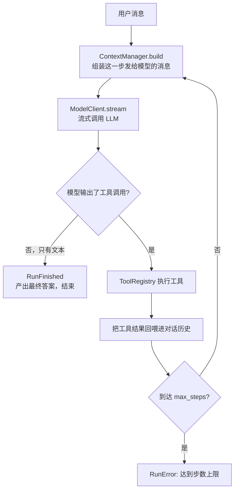

# 架构:harness 核心

> 面向第一次接触本项目的人。`harness` 是本项目自研的**最小 Agent 运行时内核**(位于
> `src/harness/`),不依赖任何 Agent 框架。它只负责一件事:**驱动"模型 ↔ 工具"的循环**,
> 把大模型变成一个能调用工具、能记忆、能被观测的 Agent。上层的 `app/`(见
> [app 层架构](architecture-app.md))把它包装成一个学习助手 Web 服务。

## 一句话理解

大模型本身只会"输入文字 → 输出文字"。要让它**动手做事**(查资料、跑代码、抓网页),需要一个
循环:让模型说"我要调用某工具",程序去执行,把结果回喂给模型,如此往复直到它给出最终答案。
这个循环就是 `harness` 的核心 —— `AgentLoop`。

## 核心:Agent 循环

`src/harness/loop/agent_loop.py` 的 `AgentLoop` 是整个内核的心脏。它是一个经典的
**ReAct 式工具循环**:



每一"步"(step)= 一次模型调用 + 若干次工具执行。循环边界上还做了几件事:

- **预算检查**:每步开始检查 token/成本预算(`BudgetTracker`),超了就停。
- **检查点**:每步结束把运行状态存快照(`CheckpointStore`),进程重启可 `resume` 续跑。
- **事件流**:整个过程以**事件**(`Event`)的形式流式产出,上层据此做流式 UI、进度、统计。

## 一切皆事件

`AgentLoop.run()` 不是返回一个结果,而是**异步产出一串事件**(`src/harness/events.py`)。
这是内核与上层解耦的关键 —— 上层只消费事件,不关心循环内部:

| 事件 | 含义 |
| --- | --- |
| `RunStarted` / `StepStarted` / `StepFinished` / `RunFinished` | 运行/步骤的生命周期 |
| `TextDelta` / `ReasoningDelta` | 正文 / 思考内容的流式增量 |
| `ToolCallRequested` / `ToolStarted` / `ToolFinished` | 工具调用的请求与执行 |
| `ModelUsage` | 本步 token/成本/延迟 |
| `ApprovalRequired` / `ApprovalResolved` | 危险命令需人工确认 |
| `Progress` | 沙箱初始化、子 agent 派发等旁路进度 |
| `RunError` | 出错 |

## 各子系统一览

`harness` 按职责切成若干子目录,每块只做一件事、可独立替换:

| 子系统 | 目录 | 职责 |
| --- | --- | --- |
| **循环** | `loop/` | `AgentLoop`:模型↔工具的主循环、续跑 |
| **模型客户端** | `llm/` | `ModelClient` 接口;`OpenAICompatibleClient`(任意 OpenAI 兼容端点)+ `RetryingModelClient`(自动重试) |
| **工具** | `tools/` | `Tool` 基类 + `ToolRegistry`;内置工具:计算器、联网请求、记忆检索/写入、读写文件、跑代码、抓网页等 |
| **上下文** | `context/` | 决定每步发给模型的消息;窗口裁剪/预算(见 [上下文管理](context-management.md)) |
| **记忆** | `memory/` | 向量存储、语义检索、智能写入、整合(见 [记忆管理](memory-management.md) / [RAG 检索](rag-retrieval.md)) |
| **持久化** | `persistence/` | `CheckpointStore`(断点续跑)、`TrajectoryStore`(逐字轨迹留痕) |
| **沙箱** | `sandbox/` | 在隔离的 Docker 容器里跑代码/命令 |
| **浏览器** | `browser/` | 无头浏览器(Playwright)抓取需要 JS 的网页 |
| **MCP** | `mcp/` | 接入外部 MCP 工具服务(stdio / streamable-http) |
| **技能** | `skills/` | 渐进式披露:按需加载技能说明,不撑爆上下文 |
| **多智能体** | `orchestration/` | `DispatchTool`:把子任务派给专职子 agent(树状,限深) |
| **可靠性** | `reliability/` | 预算追踪、失败重试 |
| **可观测** | `telemetry/` | OpenTelemetry 埋点(未装 provider 时零开销) |
| **审批** | `approval.py` | 检出危险命令 → 发 `ApprovalRequired` 等人工确认 |
| **基础类型** | `types.py` / `state.py` / `usage.py` | 消息/角色/工具调用、运行状态、token 与计费 |

## 模型客户端:分层包装

调用 LLM 走一条分层的客户端链,每层只加一种能力:

```
AgentLoop
  └─ RetryingModelClient      # 瞬时错误自动重试(指数退避)
       └─ OpenAICompatibleClient  # 把消息+工具 schema 变成归一化的流式 chunk
            └─ 任意 OpenAI 兼容端点(OpenAI / 千问 Qwen / 自建 vLLM …)
```

因为只依赖"OpenAI 兼容"这一契约,**换模型/换厂商只改配置**(`base_url` / `model` / `api_key`),
代码不用动。还支持按角色分档:主模型、快速档(机械活)、judge 档(打分),见 [app 层](architecture-app.md)。

## 工具:统一契约

每个工具继承 `Tool`,声明名字、描述和参数(Pydantic 模型 → 自动生成 JSON schema 给模型看)。
`ToolRegistry` 汇总所有工具;`AgentLoop` 把它们的 schema 一起发给模型,模型选择调用哪个。
新增一种能力 = 写一个 `Tool` 子类并注册,循环无感知。

### 新工具该放哪:`harness/tools/builtins/` 还是 `app/tools/`

两处都有工具目录,判据是**这个工具离开学习助手还有没有意义**:

- **`src/harness/tools/builtins/`** —— 与业务无关的通用能力:算术、抓网页、发 HTTP、
  跑代码、读写文件、检索记忆。换个产品照样能用。
- **`app/tools/`** —— 学习助手的领域工具:题库、错题集、知识库、附件、下载区。
  离开这个产品就没有意义。

有个很硬的经验判据:看构造函数要什么。`app/tools/*` 几乎都要 `user_id`、
`question_store`、`download_store` 这类**应用态**;`harness/tools/builtins/*` 不需要。
**带用户态或业务存储的,一律归 app。**

## 分层:harness 是库,app 是它的消费者

两者**不是平级模块**。`pyproject.toml` 里只有 `packages = ["src/harness"]` 会被打包
——发布出去的产物是 `harness`(一个可分发的 Agent 运行时内核),`app/` 不在其中,
它是建于其上的第一个应用。`skills/`、`web/`、`evals/` 同理,都属于 app 层。

**依赖方向必须单向:`app` → `harness`,反向零依赖。**

这条线由 `tests/test_architecture_layering.py` 用 AST 扫描钉死:`src/harness/**` 里
出现任何 `import app` / `from app.x` 即测试失败。它靠人自觉是守不住的——随手写一句
`from app.config import AppConfig` 就能把内核焊死在这个产品上,而且运行时不会有任何
报错,只有发布时才发现打出来的包 import 不动。

内核确实需要感知上层的东西时,走**鸭子类型或回调注入**(见下方设计原则),不要反向 import。

## 几条设计原则

- **内核零改动、鸭子类型扩展**:上层要加能力(如注入对话历史、分层上下文),用鸭子类型
  实现同样接口塞进来,而不是改 `harness` 内核。内核保持最小、稳定。
- **事件驱动解耦**:内核只管产出事件,UI/统计/落库都在上层消费,互不牵连。
- **优雅降级**:记忆检索、重试、预算、审批等都可关闭或失败降级,缺了某项也能正常跑。
- **可续跑**:每步存检查点,进程崩了能从上一完整步续跑(有副作用工具可能整步重跑,需幂等)。

## 代码入口

- 主循环:`src/harness/loop/agent_loop.py`
- 事件定义:`src/harness/events.py`
- 模型客户端:`src/harness/llm/`
- 工具基类与内置工具:`src/harness/tools/`
- 上层如何装配这些:见 [app 层架构](architecture-app.md) 的 `build_harness`
